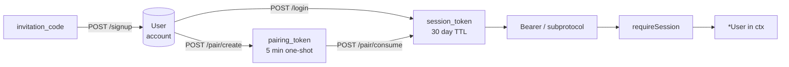
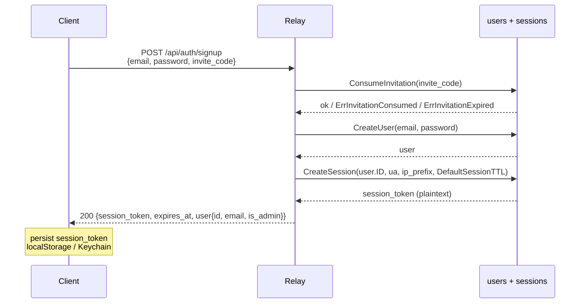
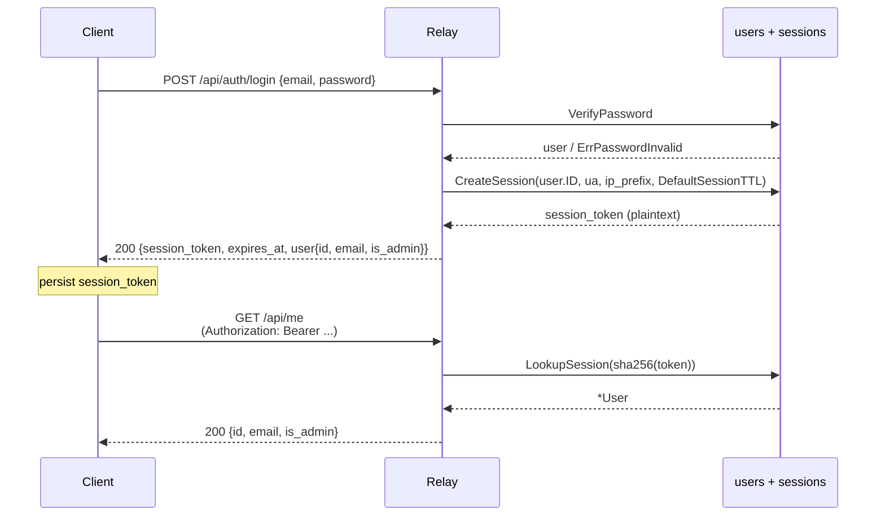
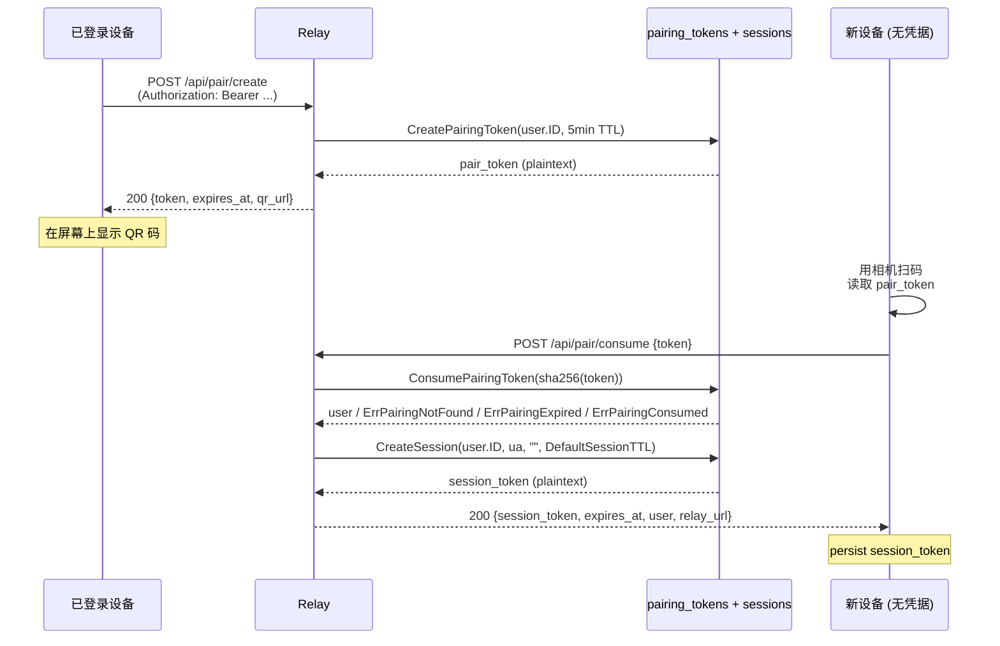
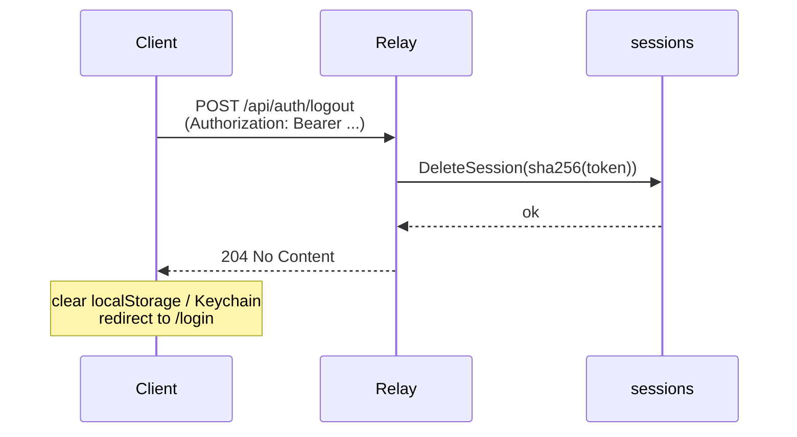

# Auth — Atterm Session Token Reference

> **Audience**: 实现或审计 atterm 鉴权层的工程师
> **Last updated**: 2026-06-10
> **Status**: stable
> **See also**: [protocol.md](./protocol.md) · [architecture.md](./architecture.md)

## 目录

1. [设计目标与历史](#1-设计目标与历史)
2. [概念模型](#2-概念模型)
3. [数据模型](#3-数据模型)
4. [鉴权流](#4-鉴权流)
5. [传输层](#5-传输层)
6. [requireSession 中间件](#6-requiresession-中间件)
7. [公开路由白名单](#7-公开路由白名单)
8. [Bootstrap admin 详解](#8-bootstrap-admin-详解)
9. [安全考量](#9-安全考量)
10. [错误码字典](#10-错误码字典)
11. [客户端实现要点](#11-客户端实现要点)

---

## 1. 设计目标与历史

atterm 早期同时存在三套独立的鉴权凭据：长期 API token (`atk_…`)、全局 share-secret (`Config.Token`)、HTTP-only cookie 加 CSRF。三套机制各自的代码路径、错误模型、客户端存储方式都不同，每加一个 endpoint 都要决定走哪一条，是 bug 的高发源。

`relay-auth-token-removal` 系列（PR #133-#137，spec 见 [2026-06-09-relay-auth-token-removal-design.md](../superpowers/specs/2026-06-09-relay-auth-token-removal-design.md)）把这三套合并为一条：

- 所有客户端通过邮箱 + 密码登录获得 `session_token`
- `session_token` 在客户端持久化（localStorage / Keychain / 桌面 config），在请求中通过 `Authorization: Bearer` 或 `Sec-WebSocket-Protocol: atterm-token.<token>` 携带
- 服务端用 `requireSession` 中间件统一拦截，命中即把 `*User` 注入 request context

这份文档是该模型的唯一权威源——所有其他 spec（`protocol.md`、`architecture.md`、`AGENTS.md`、`README.md`）在涉及鉴权时反向链接到这里。

## 2. 概念模型



| 概念 | 生命周期 | 持久化 | 用途 |
|---|---|---|---|
| `User` | 永久（直到 admin disable / delete） | `users` 表 | 身份载体 |
| `session_token` | 30 天 TTL（无滑动续期） | `sessions` 表（DB 存 sha256，明文仅响应一次） | 客户端日常凭据 |
| `pairing_token` | 5 分钟，一次性消费 | `pairing_tokens` 表 | QR 配对、跨设备引导 |
| `invitation_code` | 7 天 TTL，一次性消费 | `invitations` 表 | 邀请新用户注册 |

## 3. 数据模型

数据库 schema 来源：`internal/userstore/migrations/0001_init.sql`。

### 3.1 `users`

```sql
CREATE TABLE users (
    id            TEXT PRIMARY KEY,
    email         TEXT NOT NULL UNIQUE COLLATE NOCASE,
    password_hash TEXT NOT NULL,
    is_admin      INTEGER NOT NULL DEFAULT 0,
    created_at    INTEGER NOT NULL,
    disabled_at   INTEGER
);
```

- `password_hash` 由 argon2id 生成，`internal/userstore/users.go` 中的 `CreateUser` / `VerifyPassword` 是唯一写入 / 读取点
- `disabled_at` 非空时，所有 `LookupSession` 调用对该用户的 session 都返回 `ErrSessionInvalid`，相当于踢出所有设备

### 3.2 `sessions`

```sql
CREATE TABLE sessions (
    id_hash      TEXT PRIMARY KEY,
    user_id      TEXT NOT NULL REFERENCES users(id) ON DELETE CASCADE,
    created_at   INTEGER NOT NULL,
    expires_at   INTEGER NOT NULL,
    last_seen_at INTEGER NOT NULL DEFAULT 0,
    user_agent   TEXT NOT NULL DEFAULT '',
    ip_prefix    TEXT NOT NULL DEFAULT ''
);
CREATE INDEX sessions_user_idx ON sessions(user_id);
CREATE INDEX sessions_expires_idx ON sessions(expires_at);
```

- `id_hash` 是明文 `session_token` 的 sha256-hex；明文只在 `CreateSession` 返回值里出现一次，之后 DB 只留哈希
- `last_seen_at` 当前未由 requireSession 主动更新（保留字段供未来 last-active UI 使用）
- 列出 user 的活跃 session 用 `sessions_user_idx`；过期扫描 sweep 用 `sessions_expires_idx`

### 3.3 `pairing_tokens`

```sql
CREATE TABLE pairing_tokens (
    token_hash   TEXT PRIMARY KEY,
    prefix       TEXT NOT NULL,
    user_id      TEXT NOT NULL REFERENCES users(id) ON DELETE CASCADE,
    created_at   INTEGER NOT NULL,
    expires_at   INTEGER NOT NULL,
    consumed_at  INTEGER
);
CREATE INDEX pairing_tokens_user_idx ON pairing_tokens(user_id);
```

- `consumed_at` 非空表示已被消费；同一 token 二次 `POST /api/pair/consume` 返回 `409 Conflict`
- TTL 5 分钟（`internal/userstore/pairing.go::DefaultPairingTTL`）

## 4. 鉴权流

每条流给一个 mermaid 时序图加步骤列表。所有 endpoint 在 §10 错误码字典中列出失败响应。

### 4.1 Bootstrap admin（首次启动）

在数据库为空、且环境变量同时设置 `ATTERM_BOOTSTRAP_ADMIN_EMAIL` + `ATTERM_BOOTSTRAP_ADMIN_PASSWORD` 时触发，仅在 relay 启动期间运行一次。

```mermaid
sequenceDiagram
    participant E as 环境变量
    participant R as atterm-relay (启动)
    participant DB as users + sessions
    participant Op as 操作员 (查看 stdout)
    E->>R: ATTERM_BOOTSTRAP_ADMIN_EMAIL/PASSWORD
    R->>DB: 若 email 不存在则 CreateUser + SetUserAdmin
    R->>DB: CreateSession(user.ID, "bootstrap", "", DefaultSessionTTL)
    DB-->>R: session_token (plaintext)
    R-->>Op: stdout: "bootstrap admin created; session_token=ses_..."
    Note over Op: 复制 token 到桌面 App config 或 curl
```

步骤：

1. 操作员在启动 relay 前设置 `ATTERM_BOOTSTRAP_ADMIN_EMAIL` 和 `ATTERM_BOOTSTRAP_ADMIN_PASSWORD`
2. relay 启动时 `internal/relay/bootstrap_admin.go::bootstrapAdmin` 检查用户是否存在；不存在则用提供的 email + password 创建并 promote 为 admin
3. 创建成功后 mint 一个新的 session（来源 = `"bootstrap"`），明文 token 写入 stdout
4. 后续操作员可 `curl -H "Authorization: Bearer <token>" http://relay/api/me` 验证

详见 §8 Bootstrap admin 详解。

### 4.2 注册（邀请码 + 邮箱 + 密码）



步骤：

1. 客户端从 admin 拿到邀请码（`inv_…`）
2. `POST /api/auth/signup` 提交 `{email, password, invite_code}`
3. 服务端验证 invite → CreateUser → CreateSession → 一次性返回 `session_token`
4. 客户端持久化 token，登录成功

### 4.3 登录（邮箱 + 密码）



步骤：

1. `POST /api/auth/login` 提交 `{email, password}`
2. `internal/userstore/users.go::VerifyPassword` 用 argon2id 验证；失败返回 `401`
3. 成功则 `CreateSession`，明文写入响应 body
4. 客户端持久化（web → localStorage；mobile → Keychain；desktop → `appConfig.RelaySessionToken`）
5. 后续请求带 `Authorization: Bearer <session_token>`；WS 升级带 `Sec-WebSocket-Protocol: atterm-token.<session_token>`

### 4.4 配对（QR + 一次性 pairing token）

让一台已登录设备给一台新设备颁发 session，不让新设备输入密码。



步骤：

1. 老设备 `POST /api/pair/create`（受 requireSession 保护，需 owner Bearer）
2. relay 生成 5 分钟一次性 pair token，记录到 `pairing_tokens`
3. 老设备把明文 token 嵌入 QR URL 显示在屏幕上
4. 新设备扫码，提取 token，`POST /api/pair/consume`（公开 endpoint，无凭据）
5. relay 原子地：标记 pair token consumed → mint 新设备的 session token → 返回
6. 新设备就是一台已登录设备

错误码：见 §10。

### 4.5 撤销

三条路径：

| 触发者 | 接口 | 影响范围 |
|---|---|---|
| 用户自己（当前设备） | `POST /api/auth/logout` | 当前 session_token 失效 |
| 用户自己（其他设备） | `DELETE /api/me/sessions/{id_hash}` | 指定 session 失效 |
| 用户自己（一键登出） | `POST /api/me/sessions/sign-out-others` | 当前 session 以外全部失效 |
| Admin | `POST /api/admin/users/{id}/reset-password` | 用户密码重置 + 所有 session 失效 |
| 系统 | `expires_at < now` | session 失效（懒检查，下次 requireSession 命中即返回 401） |

logout 的最简姿势：



## 5. 传输层

### 5.1 HTTP `Authorization: Bearer <token>`

桌面 / 移动 / 服务端到服务端的请求都使用这种姿势。token 是明文 `ses_…`（4 字符前缀 + 43 字符 base64url）。

```http
GET /api/me HTTP/1.1
Host: relay.example.com
Authorization: Bearer ses_abc123def456...
```

### 5.2 WS `Sec-WebSocket-Protocol: atterm-token.<token>`

浏览器 WebSocket API 不允许设置 `Authorization` header，所以 WS 升级时 token 走子协议头。relay 接受两种格式：

- 原文：`atterm-token.<plaintext>`
- base64url 编码：`atterm-token-b64.<base64url(plaintext)>`

后者用于 token 含子协议非法字符的极端情况（实际中不会发生，但客户端可以选）。

```http
GET /client HTTP/1.1
Host: relay.example.com
Upgrade: websocket
Connection: Upgrade
Sec-WebSocket-Key: ...
Sec-WebSocket-Version: 13
Sec-WebSocket-Protocol: atterm-token.ses_abc123def456...
```

服务器升级响应必须在 `Sec-WebSocket-Protocol` 头里回选与请求里出现的同一个子协议（`atterm-token.<...>` 或 `atterm-token-b64.<...>`），否则浏览器 abort 连接。

### 5.3 拒绝的姿势

- `?token=<...>` URL query — 永远拒绝。query 会进访问日志、HTTP referrer、浏览器历史，泄露面太大
- `Cookie: atterm_session=...` — 永远拒绝。Phase 1 删除 cookie 路径，避免 CSRF 攻击面和跨站请求歧义
- `X-Auth-Token: <...>` 或其他自定义 header — 不读

## 6. requireSession 中间件

实现位置：`internal/relay/auth.go`。所有受保护路由在 mux 注册时被这个中间件包裹。

行为：

1. **提取**：调用 `tokenFromRequest(r)`，按优先级尝试三种来源：
   - `Authorization: Bearer <token>` HTTP header
   - `Sec-WebSocket-Protocol: atterm-token.<token>` 子协议头
   - `Sec-WebSocket-Protocol: atterm-token-b64.<base64url(token)>` 子协议头
   提取不到则返回 `401 unauthorized`
2. **哈希查表**：sha256(plaintext) 得到 `id_hash`，查 `sessions` 表
3. **校验**：要求 `expires_at > now` 且关联 user 的 `disabled_at IS NULL`
4. **注入**：把 `*User` 写入 request context（key 为 `userCtxKey{}`），调用 inner handler
5. **未命中**：返回 `401 unauthorized`，**不区分** "token 不存在" / "已过期" / "user disabled" — 避免给攻击者额外信号

handler 内部用 `UserFromContext(r.Context())` 读取注入的用户。

错误响应统一为：

```http
HTTP/1.1 401 Unauthorized
Content-Type: text/plain

unauthorized
```

## 7. 公开路由白名单

只有这些 endpoint 不被 `requireSession` 包裹：

| 方法 | 路径 | 公开原因 |
|---|---|---|
| `POST` | `/api/auth/signup` | 新用户尚无凭据 |
| `POST` | `/api/auth/login` | 凭据交换入口 |
| `POST` | `/api/pair/consume` | 新设备尚无凭据，pair token 自身就是临时凭据 |
| `GET` | `/healthz` | 监控探针；不暴露任何内部状态 |
| `GET` | `/version` | 客户端版本协商 |
| `GET` | `/`, `/login.html`, `/signup.html`, 等静态资源 | 静态 SPA bootstrap |

所有其他 endpoint（含 `/api/me/*`, `/api/pair/create`, `/api/auth/logout`, `/api/push/*`, `/api/webhooks/*`, `/api/admin/*`, `/api/sessions`, `/api/sessions/seen`, WS `/agent`, `/uplink`, `/client`, `/client-sessions`）都通过 `requireSession`。

部分 endpoint 在 `requireSession` 之外还套一层 `requireAdmin`（`internal/relay/admin_http.go`），要求 `user.IsAdmin == true`。

## 8. Bootstrap admin 详解

### 8.1 触发条件

启动 relay 时同时满足：

- 环境变量 `ATTERM_BOOTSTRAP_ADMIN_EMAIL` 非空、是合法 RFC5322 邮箱
- 环境变量 `ATTERM_BOOTSTRAP_ADMIN_PASSWORD` 非空、≥ 16 字符、≥ 3 种字符类型、不在弱密码黑名单内

任一不满足，relay 跳过 bootstrap（仍可正常启动，但首个 admin 需要其他途径创建）。

### 8.2 stdout 输出格式

成功时 relay 在 `log.Printf` 输出一行：

```
2026/06/10 12:34:56 bootstrap admin created; session_token=ses_abc123def456...
```

注意：

- 行格式固定，可被 grep / awk 抓取
- 仅首次成功 create 时输出；如果 admin 已存在（重启场景），不再 mint 新 session
- 失败（密码弱、邮箱不合法）会 `log.Fatalf` 退出进程

### 8.3 自动登入桌面 App / CI 的对接姿势

CI 场景：

```bash
docker run -d \
  -e ATTERM_BOOTSTRAP_ADMIN_EMAIL=admin@ci.local \
  -e ATTERM_BOOTSTRAP_ADMIN_PASSWORD=Correct-Horse-Battery-Staple-1! \
  -e ATTERM_ORIGINS=https://ci.example.com \
  -p 8080:8080 atterm-relay
# 等 5 秒
docker logs <container> | grep "session_token=" | sed 's/.*session_token=//'
# 输出明文 token，可用于 curl 测试
```

桌面 App 场景：本地 mini-relay 由 `desktop/relay_host.go::startRelayHost` 启动，自动用 `local@atterm.local` + `appConfig.LocalAdminPassword`（首次启动随机生成）调用 bootstrap，session token 持有在 `relayHost.sessionToken`，前端通过 Wails `GetEndpoint()` 拿到。

## 9. 安全考量

### 9.1 token 存储

DB 只存 sha256(plaintext) — 数据库 dump 不能直接得到可用 token。

哈希算法选 sha256 而非 argon2id 的原因：session token 本身是 32 字节随机 + base64url 编码，熵足够大（256 bit），不需要加盐慢哈希。argon2id 留给密码（用户选的低熵字符串）。

明文 token 仅在生成时返回给客户端一次，relay 内存中也不长留。

### 9.2 SameSite / CSRF / cookie — 为什么都不用

Phase 1 之前 atterm 用 HttpOnly cookie + CSRF middleware，意图是：

- Cookie 让浏览器自动带凭据（用户体验好）
- CSRF middleware 防止跨站请求伪造

session_token 模型放弃了 cookie，原因：

- 客户端有三种（桌面、Web、iOS Capacitor），三者中只有 Web 是浏览器；桌面 / iOS 都无 cookie jar 概念
- 统一用 Bearer / subprotocol 后，三端的请求路径完全一致，少一套分支逻辑
- 没有 cookie 自动携带，就没有 CSRF 攻击面，整套 CSRF middleware 可以删除

代价：客户端必须显式管理 token 存储（不再"自动"）。

### 9.3 移动端 Keychain 存储

iOS Capacitor app 通过 `desktop/frontend/src/platform/capacitor.ts::STORAGE_KEY = "atterm.relay.session"` 在 iOS Keychain 中保存 session token。Keychain 由 iOS 系统加密，应用沙盒外不可读。

Web 浏览器没有等价存储——只能用 localStorage。XSS 风险：单一可信源（atterm 自家域）+ 严格 CSP（在 relay `internal/relay/server.go` 设置）让风险可控；但仍弱于 Keychain。

### 9.4 桌面 App localAdminPassword 在 config.json 的取舍

桌面 App 启动 mini-relay 时需要一个稳定密码做 bootstrap（每次启动从 `local@atterm.local` 登录）。该密码持久化在 `~/.config/atterm/config.json` 的 `local_admin_password` 字段，明文存储。

权衡：

- 只 `localhost` 监听，外部无法访问该 relay
- 密码泄露的风险等价于 config.json 本身的文件系统权限（用户家目录）
- 用 OS Keychain 存可以提升安全级别，但开发复杂度 + 平台依赖增加；当前接受现状

跟踪项见 `docs/roadmap.md` §鉴权后续。

## 10. 错误码字典

所有失败响应。

| 状态码 | 路径 / 上下文 | 触发条件 | 客户端建议 |
|---|---|---|---|
| `401` | 任意 requireSession 保护的 endpoint | token 缺失 / 哈希查不到 / `expires_at < now` / user disabled | 清本地 token，跳登录 |
| `400` | `POST /api/auth/login` | JSON 解析失败、email/password 空 | 校验表单 |
| `401` | `POST /api/auth/login` | 密码错 | 提示"邮箱或密码错"（不区分） |
| `400` | `POST /api/auth/signup` | 邀请码无效 / 邮箱格式错 / 密码强度不足 | 显示具体错 |
| `409` | `POST /api/auth/signup` | 邮箱已被注册 | 提示用户去登录 |
| `400` | `POST /api/pair/consume` | JSON 解析失败、token 空 | 重新扫码 |
| `404` | `POST /api/pair/consume` | token 不存在 | 重新让老设备生成 |
| `409` | `POST /api/pair/consume` | token 已被消费 | 重新让老设备生成 |
| `410` | `POST /api/pair/consume` | token 已过期（5 分钟 TTL 用完） | 重新让老设备生成 |
| `403` | `POST /api/admin/*` | user.IsAdmin == false | 提示无权限 |
| `204` | `POST /api/auth/logout` | 正常 | 清本地 token |
| `500` | 任何 endpoint | DB 故障等 | 重试或提示后端故障 |

WS 升级失败统一表现为 HTTP 状态码（在 upgrade 之前），客户端在 `onerror` 中读取 status code。

## 11. 客户端实现要点

### 桌面（Wails + Vue）

- 远程 relay 登录：`desktop/app.go::LoginRemoteRelay` Wails 方法，POST 到 `/api/auth/login`，把响应 `session_token` 写入 `appConfig.RelaySessionToken`
- 本地 mini-relay：`desktop/relay_host.go::startRelayHost` 启动时 bootstrap 本地 admin，`relayHost.sessionToken` 持有
- HTTP 请求统一带 Bearer：`desktop/app.go` 中的 `FetchRelayMe` / `CreatePairingToken` 等方法
- WS upstream：`desktop/uplink.go::runOnce` 通过 HTTP header 设 `Authorization: Bearer`

### Web (`web/src/`)

- 统一入口 `web/src/shared/api/client.ts::apiFetch` — 自动读取 localStorage 的 `RelayConfig.sessionToken`，挂 Bearer header
- 登录持久化 `web/src/shared/api/auth.ts::login` — 把响应写入 `saveRelayConfig`
- 401 拦截：`apiFetch` 检测到 401 自动 `clearRelayConfig()` + 跳 `/login.html?next=...`
- 浏览器 WS：`web/src/shared/ws/client-conn.ts::openWS` 通过子协议传 token

### iOS Capacitor (`desktop/frontend/src/`)

- 配对消费：`desktop/frontend/src/platform/capacitor.ts::consumePairing` 解析 `{session_token, expires_at, relay_url, user}`
- Keychain 存储：`STORAGE_KEY = 'atterm.relay.session'` 在 `capacitor.ts:6`
- HTTP 请求：用 `Authorization: Bearer`，`credentials: 'omit'` 显式禁 cookie
