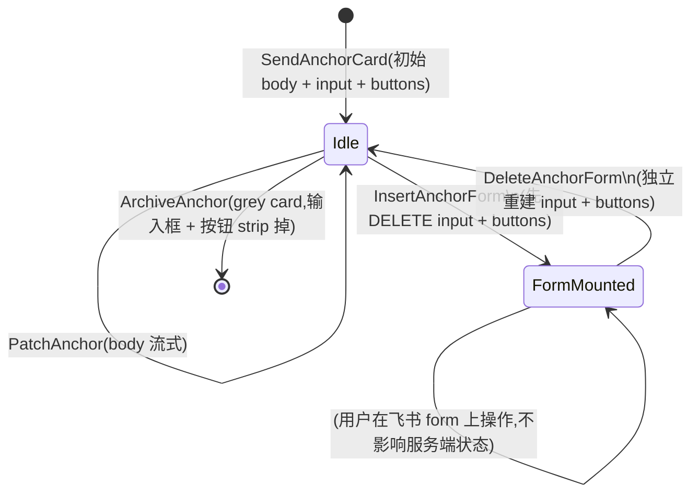
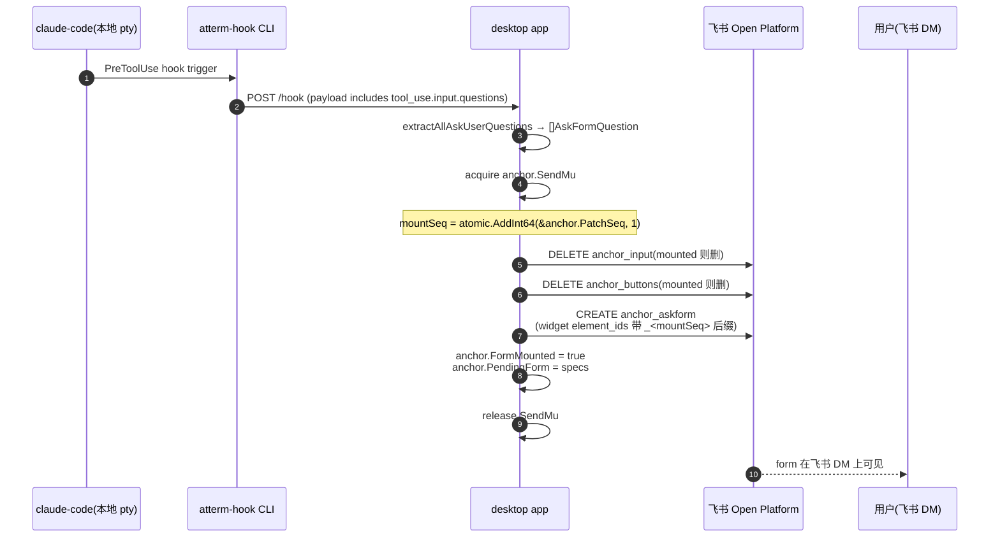

# Feishu — 远程终端与 AskUserQuestion form 子系统

> **Audience**: 实现或审计 atterm 飞书集成路径的工程师(anchor card 生命周期 / AskUserQuestion 表单式远程回答 / local vs relay 模式分流)
> **Last updated**: 2026-07-24
> **Status**: shipped through v0.2.171
> **See also**: [architecture.md](./architecture.md) · [protocol.md](./protocol.md) · [auth.md](./auth.md) · [../superpowers/specs/2026-07-10-askuserquestion-form-flow-spec.md](../superpowers/specs/2026-07-10-askuserquestion-form-flow-spec.md)

## 目录

1. [设计目标与历史](#1-设计目标与历史)
2. [两种模式:local vs relay](#2-两种模式local-vs-relay)
3. [Anchor card 生命周期](#3-anchor-card-生命周期)
4. [AskUserQuestion form flow](#4-askuserquestion-form-flow)
5. [Hook payload 与 tool_use 桥接](#5-hook-payload-与-tool_use-桥接)
6. [已知限制与 workaround](#6-已知限制与-workaround)
7. [错误码与常见故障](#7-错误码与常见故障)
8. [代码入口速查](#8-代码入口速查)

---

## 1. 设计目标与历史

飞书集成经历了三个阶段:

1. **命令完成通知**(早期,通用 webhook 路径):任务完成时 relay 通过 `internal/webhook` 向飞书 open API 推 IM 消息卡片。payload = session id + summary,不带原始输出。
2. **anchor card 作为远程终端**(v0.2.15x+,PR 系列 `feishu-as-terminal`):把 IM 卡片升级成**持续更新的锚点卡** —— body 流式承载 assistant 输出、卡片自带输入框 + `^C/^D/Esc/Enter/结束` 按钮直接把用户操作送回本地 pty。用户不用打开桌面就能远程回复正在等待的 AI 会话。
3. **AskUserQuestion 表单式回答**(v0.2.171,PR #261):claude-code 触发 AskUserQuestion tool 时,锚点卡片挂载一份 form container —— 每题一行下拉 + 自定义输入框,提交后系统按反向工程的按键模型自动送 stroke 到本地 claude TUI。

设计一致性:所有阶段共用**一个 `internal/feishu` client**,同一 anchor card 上的四个子元素(`anchor_body_md` / `anchor_input` / `anchor_buttons` / `anchor_askform`)状态互相独立,DELETE 和 CREATE 全部幂等。

## 2. 两种模式:local vs relay

| 维度 | local 模式 | relay 模式 |
|---|---|---|
| 网络路径 | 桌面 app 直连飞书 Open Platform(LongConn) | 桌面 app → 中央 relay(`cmd/atterm-relay`)→ 飞书 |
| 应用凭据存储 | 本机钥匙串(macOS Keychain / Linux Secret Service / Windows Credential Manager) | Relay `users.db` 里的字段级加密 + DB `relay_config` 表的 `AdminConfig.Feishu`(`internal/userstore/relay_config.go`;SQLite/Postgres 双后端) |
| 事件订阅 | 桌面 app 直接跑 `feishu-sdk-go` LongConn subscriber | Relay 跑 subscriber,通过 `/uplink` 转发到桌面 |
| 适用场景 | 单人自用 / 内网 / 无公网 relay 时 | 多设备访问 / 团队共享 relay / 桌面不常在线 |
| 配置入口 | 桌面 Settings → Feishu → Local | 桌面 Settings → Feishu → Relay(实际写 `/admin/api/feishu`) |

**模式切换是显式的**(桌面 Settings 有 mode selector),两种模式的 credential 不共享。切换模式不迁移凭据,需要在新模式下重新绑定飞书应用。

**红线**:
- Local 模式的钥匙串存储在 `desktop/feishu_local_settings.go`,不要走 sqlite。
- Relay 模式的字段加密走 `internal/relay/admin_config.go::AdminConfig.Feishu.EncryptKey`(base64 32B),持久化在 DB `relay_config` 表(SQLite/Postgres,由 `ATTERM_RELAY_DB_DRIVER`/`ATTERM_RELAY_DB_DSN` 选后端;`relay.json` 已完全退役,不再读写),GET 只回显末 4 位。见 [AGENTS.md 红线 #26](../../AGENTS.md#关键设计原则红线)。
- `userstore.Open` 允许 secret cipher 为 nil(即使 relay 没启用飞书也能启动),仅飞书 CRUD 在 cipher nil 时报错;不要把 `ATTERM_FEISHU_ENCRYPT_KEY` 重设为启动必填。

## 3. Anchor card 生命周期

### 3.1 四个子元素

一张 anchor card(Feishu CardKit v2 `schema: "2.0"`,`cardkit:card:write` scope)包含四个 `element_id`:

| element_id | 内容 | mounted-态标记 |
|---|---|---|
| `anchor_body_md` | Markdown 流式输出(assistant text + status preamble) | 始终存在,不删 |
| `anchor_input` | 单行 text 输入框,提交后触发 `input` card action | `CardAnchor.CurrentInputID != ""` |
| `anchor_buttons` | 5 列 column_set:`^C / ^D / Esc / Enter / 结束` | `CardAnchor.ButtonsMounted` |
| `anchor_askform` | AskUserQuestion form container(仅在 tool 触发时挂) | `CardAnchor.FormMounted` |

**三件独立**:input / buttons / form 各自 gate 在自己的 mounted 标记,DELETE 和 CREATE 幂等。挂 form 时先 DELETE input 和 buttons(form 独占交互面),拆 form 时按 mounted 标记独立重建 input 和 buttons。

### 3.2 状态转换



### 3.3 SendMu 序列化

`CardAnchor.SendMu` 是同一 anchor 的 send 序列化锁。**每一个** CREATE / DELETE / PATCH / UpdateCardElement 都在 SendMu 内分配 `PatchSeq` 并发出 —— 飞书对同一 card 的 op 用 monotonic sequence 强校验(`code=300317 sequence compare failed`),SendMu 保证同一 anchor 下不会有 seq 交叉。

流式 body PATCH 频率高(默认 30s 心跳 + 事件驱动),要确保它和 form / input / buttons 的 op 都排队走 SendMu。

### 3.4 Takeover 中途开启的懒回填(lazy backfill)

`OnRemoteTerminalToggle(true)` 本身**仍然是 no-op** —— binding 的 `RemoteTerminalEnabled` 打开时不会批量给所有已在跑的 AI 会话补 anchor card(`desktop/relay_host.go::OnRemoteTerminalToggle`)。真正的补卡入口在别处,懒触发而非跟随开关事件:

- `sess.SetOnTaskStateChange` 回调里,每次任务态转换都先调 `h.lazyAttachIfMissing(ctx, sess, sid)`。
- `Dispatcher.SetOnTurnMissingChunker` 注册 `h.onTurnMissingChunker` —— 一个 `TurnEvent` 到达但该 session 还没有 `AIChunker` 时(即中途开启 takeover、`NewSession` 时没注册 subscriber 的会话)触发同一条懒回填路径。

两个入口都收敛到 `lazyAttachIfMissing → attachFeishuSubscriberForAutoAttach(ctx, sess, sid, "ai")`,并用 `tryStartLazyAttach` / `clearLazyAttachInFlight` 做 per-session in-flight 门控,防止任务态转换和 TurnEvent 并发触发时重复 attach。

**行为**:用户在会话跑起来之后才打开 remote-terminal takeover,不需要重启会话或手动 `/attach`,anchor card 会在下一次任务态变化或下一个 turn 事件时自动补上 —— 触发那一刻的 turn body 会丢(attach 是异步的,补上的是"下一条"起的流式输出),但从下一个 turn 开始 anchor card 就跟得上。

## 4. AskUserQuestion form flow

### 4.1 Form 挂载

Hook `PreToolUse(matcher=AskUserQuestion)` 到达时,桌面 app 走以下步骤挂 form:



Widget element_id 命名规则(每次挂 form 换新):

- 单选下拉:`askform_q<i>_sel_<mountSeq>` (`tag: "select_static"`)
- 多选下拉:`askform_q<i>_sel_<mountSeq>` (`tag: "multi_select_static"`)
- 自定义输入:`askform_q<i>_txt_<mountSeq>` (`tag: "input"`)

`<mountSeq>` 是 mount 时 `PatchSeq` 的当前值,每次挂 form 换新 —— 见 [§6.2 飞书 form widget 状态缓存](#62-飞书-form-widget-状态缓存)。

### 4.2 用户提交后的 stroke plan

用户在飞书 form 上填完点提交,飞书回调 card action(`kind: "form"`)。桌面 app 走以下步骤按题构造 stroke 序列送到本地 claude pty:

```
handleAskFormSubmit(sessionID, operatorOpenID, formValue)
  ├─ anchor.SendMu.Lock() → snapshot anchor.PendingForm → Unlock
  ├─ parseAskFormSlots(formValue) → []askFormSlot
  │      每 slot 含:idx / sel(string,单选) / selMulti([]string,多选) / txt(自定义)
  ├─ for each slot:
  │      qStrokes := buildQuestionStrokes(question, slot)
  │      strokes = append(strokes, qStrokes...)
  ├─ strokes = append(strokes, '1')  // Review page: "Submit answers" 是选项 1
  └─ Router.InjectKeystrokesBySession(sessionID, operatorOpenID, strokes, 350ms)
        // 每键一个 SendInput,首键 inline,余键 goroutine 内 sleep+send
```

### 4.3 每题类型的 stroke 序列

`buildQuestionStrokes` 按 (isMulti, hasCustom) 组合选分支:

| 分支 | Stroke 序列 | Advance 键 |
|---|---|---|
| 单选,无 custom | `<digit>` | 数字键自身触发 select + confirm + advance(claude TUI 特性) |
| 多选,无 custom | `<digit>*M`(每选中一个 label 一个 digit) | Tab(`\t`,0x09):cursor 在 checkbox row 时 Tab advance |
| 单选,有 custom | `<typeIdx> <text runes> <space>`(尾部空格是牺牲字符,见 §6.1) | Enter(`\r`,0x0d):siH.onSubmit 用 siH 自己的 local 状态 |
| 多选,有 custom | `<digit>*M <typeIdx> <↓>×(typeIdx-1) <text runes> <space> <↓>` | Enter(0x0d):走光标到 Submit button,触发容器的 `if (X && Y) { Y(D); return; }` |
| Review page(所有题末尾) | `1` | (合并进主 strokes 序列尾) |

`typeIdx = len(Options) + 1` —— Type-something 在选项列表倒数第二位(最后一位是 "Chat about this")。

**详细按键模型 + 反编译验证 + 拒绝方案清单**见:

- `~/.claude/projects/-Users-attson-code-github-com-attson-atterm/memory/feedback_askform_key_model.md` — 完整血泪史 + 所有推翻的假设(Tab-to-advance 单选 / Ctrl+Return via LF 0x0a / Right-arrow pump / 各种 delay 值)
- [../superpowers/specs/2026-07-10-askuserquestion-form-flow-spec.md](../superpowers/specs/2026-07-10-askuserquestion-form-flow-spec.md) §3-4 — shipped design 记录

### 4.4 Stroke 间隔与序列化

`Router.InjectKeystrokesBySession(sessionID, operator, strokes, 350ms)`:

- 首键 inline(能 surface reject 如 PTY inbound queue 满)
- 剩余键 goroutine 里 `time.Sleep(350ms)` 后 `SendInput`
- 350ms 是硬性下限:小于该值会撞 React state race,大于也无害(4 题 form 大约 4-5 秒)

**红线**:不要把 350ms 降下来省用户等待时间。曾试 80 / 150 / 200 / 350 / 700ms,只有 ≥350ms 稳定。见 memory 里"delay tuning 是死路"章节。

### 4.5 Form 拆除

用户提交 form 成功后,桌面 app:

1. `s.deleteAnchorForm(anchor)` — DELETE `anchor_askform` element(飞书 client 侧 form 消失)
2. 等 claude 处理完 tool_use,发出 Stop hook(assistant 生成 tool_result 后的最终 turn)
3. Stop hook 走 `dispatcher.DispatchTurn(sid, TurnAssistantFinal(Text=..., FormQuestions=nil))`
4. `onAskForm(sid, nil)` 触发 `relay_host.updateAnchorAskForm(sid, nil)` → `deleteAnchorForm`(幂等)+ 按 mounted 标记独立 CREATE 回 input 和 buttons

如果用户不提交、claude 也 moved on,Stop hook 依然触发第 4 步,拆 form 并恢复。

## 5. Hook payload 与 tool_use 桥接

### 5.1 claude-code hook 契约

atterm 桌面在 pty 环境注入两个变量:

- `ATTERM_SESSION_ID` — session id,让 hook payload 认得回哪个 session
- `ATTERM_HOOK_ENDPOINT` — `http://127.0.0.1:<mini-relay port>/hook`,`atterm-hook` CLI POST 到这里

atterm 拦截的 hook 事件类型:

| 事件 | Matcher | 用途 |
|---|---|---|
| `PreToolUse` | `AskUserQuestion` | 挂 anchor form + 存 questions |
| `PreToolUse` | (其他 tool) | body 里 "🔧 Tool: X" 标记(可选流式提示) |
| `PostToolUse` | 所有 | body 里显示 tool 结果尾 |
| `Notification` | `permission_prompt` / `idle_prompt` / `elicitation` | body 添加 "⏸ 等待输入" preamble + 触发 WaitingInput card action(anchor 已 live 时抑制,避免重复) |
| `Stop` | — | 最终 assistant text 覆盖 body + 拆 form(如挂) |
| `UserPromptSubmit` | — | 检测 transcript_path 变化,若换会话则 reset AIRoller |

**AskUserQuestion 特殊:不触发 Notification hook**。必须 hook `PreToolUse(matcher=AskUserQuestion)` 才能拿到 question + options 结构。这是 memory `project_claude_code_askquestion_no_notification.md` 记录的经验。

### 5.2 Extract questions

`desktop/feishu/hook_adapter.go::extractAllAskUserQuestions` 从 `tool_input.questions[]` 抽出:

```go
type AskUserQuestionEntry struct {
    Question    string
    MultiSelect bool
    Options     []QuestionOption
}
```

- `MultiSelect` 来自 tool_input 里 `multiSelect: true`(用户在 claude-code prompt 里显式标注多选题)
- `Options` 里的 `Label` 就是飞书 form 下拉里显示的字符串,回收 formValue 时按 label 反查 index(1-based)

## 6. 已知限制与 workaround

### 6.1 claude Type-something 稳定丢最后一字符

**症状**:用户在飞书 form 的 custom text 里填 "项目管理",claude 收到 "项目管"(缺 "理")。用户手动键盘输入也丢 —— 是 claude TUI 层面的 bug,不是 stroke 序列问题。

**Workaround**(已内置):`buildQuestionStrokes` 里给每段 custom text 尾部追加一个空格作为**牺牲字符**(`text := sl.txt + " "`)。claude 丢掉的就是空格,用户原文完整。UTF-8 rune 或 ASCII 都一样管用。

**不要拆掉**这个空格 workaround。曾试过:

- 增大 stroke delay(80ms → 350ms → 700ms,全丢)
- 每题最后 rune 前塞 Right-arrow pump(不解决问题)
- 用 Ctrl+Return via LF 0x0a 绕开 blur race(ink 不识别 0x0a 为 Ctrl+Return,当普通 Enter 处理)

都不通,详见 memory `feedback_askform_key_model.md`。这是 upstream 的锅,workaround 是最优解。

### 6.2 飞书 form widget 状态缓存

**症状**:同一 anchor card 上连续触发 2 次 AskUserQuestion,第 2 次 form 出现时下拉和 txt 里加载了上一次 submission 的选择/文本 —— 让用户以为答案没换成功。

**根因**:飞书 CardKit v2 client 按 `element_id` 缓存 widget 状态,即使 DELETE + CREATE 用同一 `element_id` client 也不清缓存。

**Workaround**(已内置):`RenderAskQuestionForm(sessionID, questions, mountSeq int64)` 里每个 widget 的 `element_id` 都带 `_<mountSeq>` 后缀,`mountSeq` 来自当次挂 form 时 `PatchSeq` 分配的新值。每次挂 form widget id 都是全新的,client 认成新 widget,不加载缓存。

**红线**:不要把 `_<mountSeq>` 后缀去掉,也不要只旋转部分 widget id —— 部分同名部分不同名会让 form 上一半空一半有历史值。

### 6.3 AskUserQuestion permission grant 前置

**症状**:第 1 次远程回答 form 时,form 提交后 claude 没走到最后一题就 tool wedges。抓 log 看,stroke 序列头两键(`1\r`)被 permission dialog 消费。

**根因**:claude-code 首次触发 AskUserQuestion 时 TUI 会弹一个 permission dialog("Allow using AskUserQuestion?");用户没先在本地按 "Yes, and don't ask again",dialog 每次都吃前两个 stroke。

**Workaround**(用户操作,一次性):本地 claude-code 首次遇到 AskUserQuestion 权限对话框,选 "Yes, and don't ask again"。之后不再弹,stroke 序列头两键就能正常送到 TUI。

memory `feedback_askform_permission_grant.md` 有详细指引。

### 6.4 其他

- **飞书 API rate limit**:飞书对 `cardkit:card:write` 有 QPS 上限,body 流式 PATCH 频率过高会拿 `code=99991672`(rate limited)。目前默认 30s 心跳节流,事件驱动的 PATCH 靠 `internal/feishu.AIRoller` 合并 chunk。改动流式频率前测一下 rate limit。
- **飞书 element 20 字符限制**:`element_id` 最长 20 字符,只能字母数字下划线。widget id `askform_q<i>_sel_<mountSeq>` 里 `<mountSeq>` 数字大时可能超限 —— 但 PatchSeq 一般 <100 每张卡片,实际不会撞到。发生时会拿 `code=300301 elementID format error`,监控日志里出现应该考虑改用 hash 而非 seq。

## 7. 错误码与常见故障

| 飞书错误码 | 含义 | 常见触发 | 处理 |
|---|---|---|---|
| `300301` | `elementID format error` | element_id 超 20 字符或有非法字符 | 检查 mount seq 是否过大;widget id 生成规则可能要改 |
| `300313` | `not find elementID` | PATCH / DELETE 引用了不存在的 element | 通常是 anchor 状态和飞书 client 状态不一致(可能是 CREATE 失败了但 mounted 标记没回滚);先 grep `feishu-anchor-form: CREATE failed` 看是否有前置错误 |
| `300315` | `unknown property` | JSON 里带了飞书不识别的 property(比如 `select_static.can_input`) | 别再试 combobox 属性,飞书 select_static 没有 free-input 支持(memory 里有实测) |
| `300317` | `sequence compare failed` | 同一 card 的 seq 交叉,飞书拒了 op | 确认所有 op 在 SendMu 内分配 seq;不要在没锁的地方 `atomic.AddInt64(&anchor.PatchSeq, 1)` 后跨 goroutine 再发 |
| `230099` | `tag "action" not supported in schema 2.0` | v1 schema 的 action container 用在了 v2 卡片 | 用 column_set + button 替代 |
| `code=99991672` | rate limited | body PATCH 频率过高 | 加节流或减少心跳频率 |

**故障排查思路**:

1. 抓桌面 log:`grep -E "feishu-anchor|askform" desktop.log`
2. 看 form 挂 / 拆 / restore 是否都有配对的成功日志(`inserted` / `removed` / `input restored` / `buttons restored`)
3. 抓 `askform submit sid=... q=N strokes=M action=X` 那行,action=0 是 stroke 发出成功;非 0 说明 Router 拒了(权限 / session 已结束等)
4. 如果 claude 收到答案但不完整:trailing space workaround 是否被拆(§6.1)? mountSeq 是否每次不同(§6.2)?

## 8. 代码入口速查

见 [AGENTS.md 何时改哪里](../../AGENTS.md#何时改哪里)对应行:

| 场景 | 入口 |
|---|---|
| Anchor card 生命周期 | `desktop/relay_host.go` — `updateAnchorAskForm` / `deleteAnchorForm` / `swapAnchorButtons` |
| Takeover 中途开启懒回填(§3.4) | `desktop/relay_host.go` — `lazyAttachIfMissing` / `onTurnMissingChunker` / `OnRemoteTerminalToggle` |
| Stroke plan 逻辑 | `desktop/feishu/service.go` — `buildQuestionStrokes` / `handleAskFormSubmit` / `parseAskFormSlots` |
| Form 渲染 | `internal/feishu/anchor_card.go` — `RenderAskQuestionForm` / `NewInputElement` / `NewDefaultButtonsElement` |
| Card index 状态 | `internal/feishu/cardindex.go` — `CardAnchor` 结构 + `SendMu` / `PatchSeq` / mounted 标记 |
| Router / stroke dispatch | `internal/feishu/router.go` — `InjectKeystrokesBySession` |
| Hook 解析 | `desktop/feishu/hook_adapter.go` — `extractAllAskUserQuestions` / `ParseTurn` |
| Local / relay 分流 | `desktop/app.go`(mode router)+ `desktop/feishu_local_settings.go`(local)+ `internal/relay/admin_http.go`(relay `/admin/api/feishu`) |
| Long-conn subscriber | `desktop/feishu/longconn.go` — `newLarkRuntime` / `extractCardActionFields` |

Manual probe 脚本(需 `-tags manual_probe`,不入 CI):`desktop/feishu/manual_probe_test.go`。用来直接对着开发飞书 app 发真 API,验证 CardKit 组件语法。改 form 渲染 / 组件属性时最快的 sanity check。
