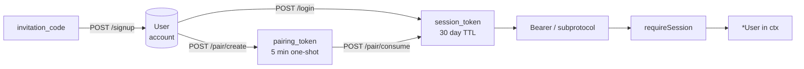
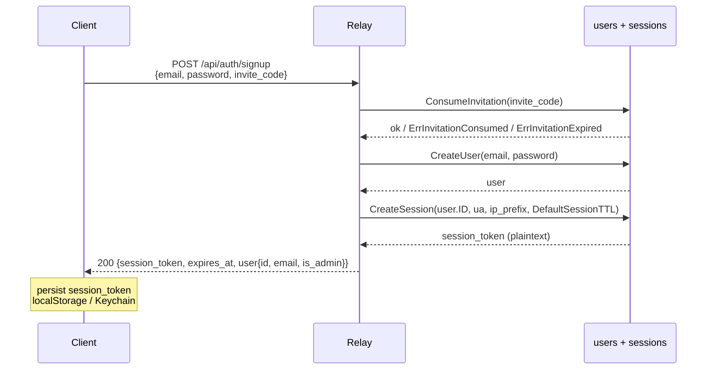
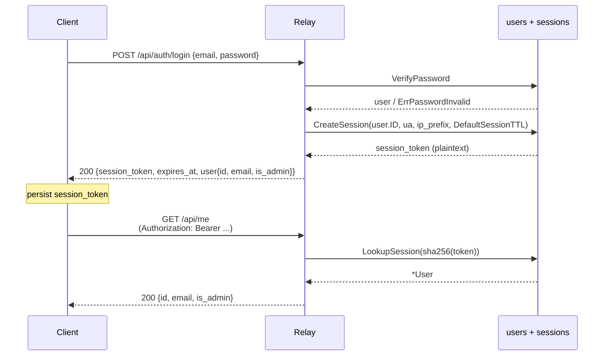
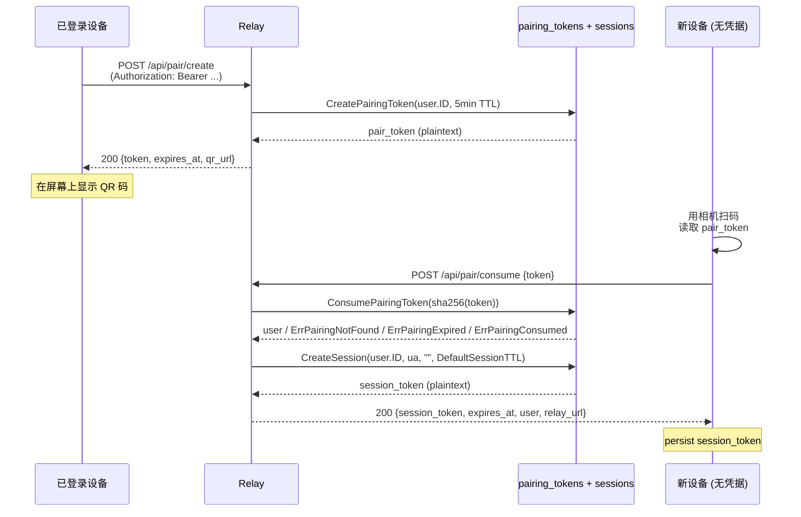
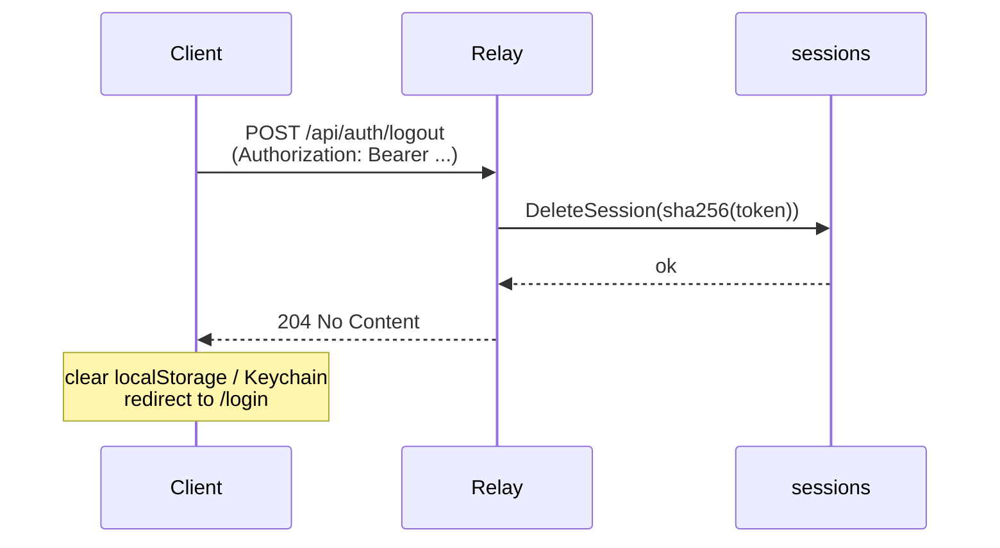

# Docs Revamp Implementation Plan

> **For agentic workers:** REQUIRED SUB-SKILL: Use superpowers:subagent-driven-development (recommended) or superpowers:executing-plans to implement this plan task-by-task. Steps use checkbox (`- [ ]`) syntax for tracking.

**Goal:** Introduce `docs/spec/auth.md` as the single source of truth for the atterm authentication model, slim down `protocol.md`/`architecture.md` accordingly, normalize metadata headers and style across all spec files, and sweep stale references (`atterm-agent`, `atk_` API token, CSRF, share-secret, `web_sessions` table) out of AGENTS.md/README.md.

**Architecture:** Pure documentation work — one new file (`docs/spec/auth.md` ~500 lines) and seven modified files (the four existing `docs/spec/*.md`, `AGENTS.md`, `README.md`, `docs/roadmap.md`). No Go or TypeScript edits. Verification is by `grep` (no stale literals), `wc` (file size targets), `head` (metadata header presence), and link integrity by visual scan.

**Tech Stack:** GitHub-flavored markdown, mermaid `sequenceDiagram` blocks (rendered natively on GitHub).

**Spec:** `docs/superpowers/specs/2026-06-10-docs-revamp-design.md`.

**Prerequisite:** PR #133, #134, #135, #136, #137 must all be merged to `main` before this plan starts. Run `git log --oneline main | head -20` and confirm session-token migration commits are on `main` before proceeding.

---

## File structure

| File | Status | Purpose | Size target |
|---|---|---|---|
| `docs/spec/auth.md` | **new** | Single source of truth for auth (Principal model, session_token lifecycle, requireSession, bootstrap, errors) | ~500 lines |
| `docs/spec/protocol.md` | modify | WS frame dictionary + non-auth HTTP API; auth section becomes a 30-line stub linking to `auth.md` | 639 → ~450 |
| `docs/spec/architecture.md` | modify | System overview; "用户与鉴权" section becomes a 5-line stub linking to `auth.md` | 482 → ~470 |
| `docs/spec/conventions.md` | modify | Add metadata header; light style normalization only | 399 → ~405 |
| `docs/spec/component-style.md` | modify | Add metadata header; light style normalization only | 333 → ~340 |
| `AGENTS.md` | modify | Drop `cmd/atterm-agent` references; link auth red lines to `auth.md`; add metadata header | 190 → ~180 |
| `README.md` | modify | Add metadata header; simplify auth descriptions; link to `auth.md` | 381 → ~360 |
| `docs/roadmap.md` | modify | Append "鉴权后续" section with 4 follow-up bullets | 269 → ~280 |

Tasks below are ordered so dependencies flow forward: `auth.md` is created first (Task 3) so subsequent tasks can link to it. Each task ends in one commit.

---

## Task 1: Create branch

**Files:** none (git only)

- [ ] **Step 1: Confirm prerequisites**

```bash
cd /Users/attson/code/github.com.attson/atterm && git checkout main && git pull --ff-only
git log --oneline main | head -10
```

Expected: the latest commits include the merged auth-migration work (look for `feat(relay)` / `feat(desktop)` / `feat(web)` / `feat(mobile)` / `chore: remove cmd/atterm-agent` subject lines). If the five PRs have not landed yet, **stop** and resume this plan after they land.

- [ ] **Step 2: Confirm working tree clean**

```bash
cd /Users/attson/code/github.com.attson/atterm && git status
```

Expected: only `.claude/` untracked (or fully clean). If anything else is modified, commit / stash / discard before continuing.

- [ ] **Step 3: Create branch**

```bash
cd /Users/attson/code/github.com.attson/atterm && git checkout -b docs/comprehensive-revamp
git rev-parse --abbrev-ref HEAD
```

Expected: prints `docs/comprehensive-revamp`.

No commit in this task — branch is the deliverable.

---

## Task 2: Add metadata header convention to existing 4 spec files

Adds the unified metadata block at the top of `protocol.md`, `architecture.md`, `conventions.md`, `component-style.md`. Spec files only — `AGENTS.md` and `README.md` get their headers in Tasks 6 and 7.

**Files:**
- Modify: `docs/spec/protocol.md` (insert at top, before line 1)
- Modify: `docs/spec/architecture.md` (insert at top, before line 1)
- Modify: `docs/spec/conventions.md` (insert at top, before line 1)
- Modify: `docs/spec/component-style.md` (insert at top, before line 1)

- [ ] **Step 1: Verify pre-state (no metadata yet)**

```bash
cd /Users/attson/code/github.com.attson/atterm && head -5 docs/spec/protocol.md docs/spec/architecture.md docs/spec/conventions.md docs/spec/component-style.md
```

Expected: each file starts with `# <Title>` directly, no `> **Audience**` line in the first 5 lines.

- [ ] **Step 2: Edit `docs/spec/protocol.md` — insert metadata block**

Find the existing `# ` H1 title at the top of the file (typically line 1). Use the `Edit` tool: replace the first H1 line with the H1 + metadata block.

Example, if the current first line is `# Atterm Wire Protocol`:

```
old_string:
# Atterm Wire Protocol

new_string:
# Atterm Wire Protocol

> **Audience**: 实现 WS 帧或 HTTP API 客户端的工程师
> **Last updated**: 2026-06-10
> **Status**: stable
> **See also**: [auth.md](./auth.md) · [architecture.md](./architecture.md)
```

If the actual H1 text differs, use the actual text in `old_string`. The `new_string` adds the metadata block immediately under the H1.

- [ ] **Step 3: Edit `docs/spec/architecture.md` — insert metadata block**

```
old_string:
# <existing H1 line>

new_string:
# <existing H1 line>

> **Audience**: 理解 atterm 系统整体结构的工程师
> **Last updated**: 2026-06-10
> **Status**: stable
> **See also**: [auth.md](./auth.md) · [protocol.md](./protocol.md)
```

- [ ] **Step 4: Edit `docs/spec/conventions.md` — insert metadata block**

```
old_string:
# <existing H1 line>

new_string:
# <existing H1 line>

> **Audience**: 改 Go / 前端代码的工程师
> **Last updated**: 2026-06-10
> **Status**: stable
> **See also**: [component-style.md](./component-style.md) · [architecture.md](./architecture.md)
```

- [ ] **Step 5: Edit `docs/spec/component-style.md` — insert metadata block**

```
old_string:
# <existing H1 line>

new_string:
# <existing H1 line>

> **Audience**: 改 atterm 前端 UI 的工程师
> **Last updated**: 2026-06-10
> **Status**: stable
> **See also**: [conventions.md](./conventions.md) · [protocol.md](./protocol.md)
```

- [ ] **Step 6: Verify post-state**

```bash
cd /Users/attson/code/github.com.attson/atterm && for f in docs/spec/protocol.md docs/spec/architecture.md docs/spec/conventions.md docs/spec/component-style.md; do echo "=== $f ==="; head -8 "$f"; done
```

Expected: each file shows H1 followed by the 4-line metadata block.

- [ ] **Step 7: Commit**

```bash
cd /Users/attson/code/github.com.attson/atterm && git add docs/spec/protocol.md docs/spec/architecture.md docs/spec/conventions.md docs/spec/component-style.md
git commit -m "docs: add metadata header convention to all spec files"
```

---

## Task 3: Create `docs/spec/auth.md`

The biggest task. Creates the new authoritative auth doc with all 11 sections from spec §5. Total file length ~500 lines.

**Files:**
- Create: `docs/spec/auth.md`

- [ ] **Step 1: Verify file does not exist**

```bash
cd /Users/attson/code/github.com.attson/atterm && ls docs/spec/auth.md 2>&1
```

Expected: `No such file or directory`.

- [ ] **Step 2: Write the file in full**

Use the `Write` tool to create `docs/spec/auth.md` with the following content. **Use this content verbatim** — do not edit beyond filling in `<…>` placeholders where indicated. The placeholders are concrete file paths or commit references the implementer is expected to verify against the codebase.

```markdown
# Auth — Atterm Session Token Reference

> **Audience**: 实现或审计 atterm 鉴权层的工程师
> **Last updated**: 2026-06-10
> **Status**: stable
> **See also**: [protocol.md](./protocol.md) · [architecture.md](./architecture.md)

## 目录

1. [设计目标与历史](#1-设计目标与历史)
2. [概念模型](#2-概念模型)
3. [数据模型](#3-数据模型)
4. [鉴权流](#4-鉴权流)
5. [传输层](#5-传输层)
6. [requireSession 中间件](#6-requiresession-中间件)
7. [公开路由白名单](#7-公开路由白名单)
8. [Bootstrap admin 详解](#8-bootstrap-admin-详解)
9. [安全考量](#9-安全考量)
10. [错误码字典](#10-错误码字典)
11. [客户端实现要点](#11-客户端实现要点)

---

## 1. 设计目标与历史

atterm 早期同时存在三套独立的鉴权凭据：长期 API token (`atk_…`)、全局 share-secret (`Config.Token`)、HTTP-only cookie 加 CSRF。三套机制各自的代码路径、错误模型、客户端存储方式都不同，每加一个 endpoint 都要决定走哪一条，是 bug 的高发源。

`relay-auth-token-removal` 系列（PR #133-#137，spec 见 [2026-06-09-relay-auth-token-removal-design.md](../superpowers/specs/2026-06-09-relay-auth-token-removal-design.md)）把这三套合并为一条：

- 所有客户端通过邮箱 + 密码登录获得 `session_token`
- `session_token` 在客户端持久化（localStorage / Keychain / 桌面 config），在请求中通过 `Authorization: Bearer` 或 `Sec-WebSocket-Protocol: atterm-token.<token>` 携带
- 服务端用 `requireSession` 中间件统一拦截，命中即把 `*User` 注入 request context

这份文档是该模型的唯一权威源——所有其他 spec（`protocol.md`、`architecture.md`、`AGENTS.md`、`README.md`）在涉及鉴权时反向链接到这里。

## 2. 概念模型



| 概念 | 生命周期 | 持久化 | 用途 |
|---|---|---|---|
| `User` | 永久（直到 admin disable / delete） | `users` 表 | 身份载体 |
| `session_token` | 30 天 TTL（无滑动续期） | `sessions` 表（DB 存 sha256，明文仅响应一次） | 客户端日常凭据 |
| `pairing_token` | 5 分钟，一次性消费 | `pairing_tokens` 表 | QR 配对、跨设备引导 |
| `invitation_code` | 7 天 TTL，一次性消费 | `invitations` 表 | 邀请新用户注册 |

## 3. 数据模型

数据库 schema 来源：`internal/userstore/migrations/0001_init.sql`。

### 3.1 `users`

```sql
CREATE TABLE users (
    id            TEXT PRIMARY KEY,
    email         TEXT NOT NULL UNIQUE COLLATE NOCASE,
    password_hash TEXT NOT NULL,
    is_admin      INTEGER NOT NULL DEFAULT 0,
    created_at    INTEGER NOT NULL,
    disabled_at   INTEGER
);
```

- `password_hash` 由 argon2id 生成，`internal/userstore/users.go` 中的 `CreateUser` / `VerifyPassword` 是唯一写入 / 读取点
- `disabled_at` 非空时，所有 `LookupSession` 调用对该用户的 session 都返回 `ErrSessionInvalid`，相当于踢出所有设备

### 3.2 `sessions`

```sql
CREATE TABLE sessions (
    id_hash      TEXT PRIMARY KEY,
    user_id      TEXT NOT NULL REFERENCES users(id) ON DELETE CASCADE,
    created_at   INTEGER NOT NULL,
    expires_at   INTEGER NOT NULL,
    last_seen_at INTEGER NOT NULL DEFAULT 0,
    user_agent   TEXT NOT NULL DEFAULT '',
    ip_prefix    TEXT NOT NULL DEFAULT ''
);
CREATE INDEX sessions_user_idx ON sessions(user_id);
CREATE INDEX sessions_expires_idx ON sessions(expires_at);
```

- `id_hash` 是明文 `session_token` 的 sha256-hex；明文只在 `CreateSession` 返回值里出现一次，之后 DB 只留哈希
- `last_seen_at` 当前未由 requireSession 主动更新（保留字段供未来 last-active UI 使用）
- 列出 user 的活跃 session 用 `sessions_user_idx`；过期扫描 sweep 用 `sessions_expires_idx`

### 3.3 `pairing_tokens`

```sql
CREATE TABLE pairing_tokens (
    token_hash   TEXT PRIMARY KEY,
    prefix       TEXT NOT NULL,
    user_id      TEXT NOT NULL REFERENCES users(id) ON DELETE CASCADE,
    created_at   INTEGER NOT NULL,
    expires_at   INTEGER NOT NULL,
    consumed_at  INTEGER
);
CREATE INDEX pairing_tokens_user_idx ON pairing_tokens(user_id);
```

- `consumed_at` 非空表示已被消费；同一 token 二次 `POST /api/pair/consume` 返回 `409 Conflict`
- TTL 5 分钟（`internal/userstore/pairing.go::DefaultPairingTTL`）

## 4. 鉴权流

每条流给一个 mermaid 时序图加步骤列表。所有 endpoint 在 §10 错误码字典中列出失败响应。

### 4.1 Bootstrap admin（首次启动）

在数据库为空、且环境变量同时设置 `ATTERM_BOOTSTRAP_ADMIN_EMAIL` + `ATTERM_BOOTSTRAP_ADMIN_PASSWORD` 时触发，仅在 relay 启动期间运行一次。

```mermaid
sequenceDiagram
    participant E as 环境变量
    participant R as atterm-relay (启动)
    participant DB as users + sessions
    participant Op as 操作员 (查看 stdout)
    E->>R: ATTERM_BOOTSTRAP_ADMIN_EMAIL/PASSWORD
    R->>DB: 若 email 不存在则 CreateUser + SetUserAdmin
    R->>DB: CreateSession(user.ID, "bootstrap", "", DefaultSessionTTL)
    DB-->>R: session_token (plaintext)
    R-->>Op: stdout: "bootstrap admin created; session_token=ses_..."
    Note over Op: 复制 token 到桌面 App config 或 curl
```

步骤：

1. 操作员在启动 relay 前设置 `ATTERM_BOOTSTRAP_ADMIN_EMAIL` 和 `ATTERM_BOOTSTRAP_ADMIN_PASSWORD`
2. relay 启动时 `internal/relay/bootstrap_admin.go::bootstrapAdmin` 检查用户是否存在；不存在则用提供的 email + password 创建并 promote 为 admin
3. 创建成功后 mint 一个新的 session（来源 = `"bootstrap"`），明文 token 写入 stdout
4. 后续操作员可 `curl -H "Authorization: Bearer <token>" http://relay/api/me` 验证

详见 §8 Bootstrap admin 详解。

### 4.2 注册（邀请码 + 邮箱 + 密码）



步骤：

1. 客户端从 admin 拿到邀请码（`inv_…`）
2. `POST /api/auth/signup` 提交 `{email, password, invite_code}`
3. 服务端验证 invite → CreateUser → CreateSession → 一次性返回 `session_token`
4. 客户端持久化 token，登录成功

### 4.3 登录（邮箱 + 密码）



步骤：

1. `POST /api/auth/login` 提交 `{email, password}`
2. `internal/userstore/users.go::VerifyPassword` 用 argon2id 验证；失败返回 `401`
3. 成功则 `CreateSession`，明文写入响应 body
4. 客户端持久化（web → localStorage；mobile → Keychain；desktop → `appConfig.RelaySessionToken`）
5. 后续请求带 `Authorization: Bearer <session_token>`；WS 升级带 `Sec-WebSocket-Protocol: atterm-token.<session_token>`

### 4.4 配对（QR + 一次性 pairing token）

让一台已登录设备给一台新设备颁发 session，不让新设备输入密码。



步骤：

1. 老设备 `POST /api/pair/create`（受 requireSession 保护，需 owner Bearer）
2. relay 生成 5 分钟一次性 pair token，记录到 `pairing_tokens`
3. 老设备把明文 token 嵌入 QR URL 显示在屏幕上
4. 新设备扫码，提取 token，`POST /api/pair/consume`（公开 endpoint，无凭据）
5. relay 原子地：标记 pair token consumed → mint 新设备的 session token → 返回
6. 新设备就是一台已登录设备

错误码：见 §10。

### 4.5 撤销

三条路径：

| 触发者 | 接口 | 影响范围 |
|---|---|---|
| 用户自己（当前设备） | `POST /api/auth/logout` | 当前 session_token 失效 |
| 用户自己（其他设备） | `DELETE /api/me/sessions/{id_hash}` | 指定 session 失效 |
| 用户自己（一键登出） | `POST /api/me/sessions/sign-out-others` | 当前 session 以外全部失效 |
| Admin | `POST /api/admin/users/{id}/reset-password` | 用户密码重置 + 所有 session 失效 |
| 系统 | `expires_at < now` | session 失效（懒检查，下次 requireSession 命中即返回 401） |

logout 的最简姿势：



## 5. 传输层

### 5.1 HTTP `Authorization: Bearer <token>`

桌面 / 移动 / 服务端到服务端的请求都使用这种姿势。token 是明文 `ses_…`（4 字符前缀 + 43 字符 base64url）。

```http
GET /api/me HTTP/1.1
Host: relay.example.com
Authorization: Bearer ses_abc123def456...
```

### 5.2 WS `Sec-WebSocket-Protocol: atterm-token.<token>`

浏览器 WebSocket API 不允许设置 `Authorization` header，所以 WS 升级时 token 走子协议头。relay 接受两种格式：

- 原文：`atterm-token.<plaintext>`
- base64url 编码：`atterm-token-b64.<base64url(plaintext)>`

后者用于 token 含子协议非法字符的极端情况（实际中不会发生，但客户端可以选）。

```http
GET /client HTTP/1.1
Host: relay.example.com
Upgrade: websocket
Connection: Upgrade
Sec-WebSocket-Key: ...
Sec-WebSocket-Version: 13
Sec-WebSocket-Protocol: atterm-token.ses_abc123def456...
```

服务器升级响应必须在 `Sec-WebSocket-Protocol` 头里回选与请求里出现的同一个子协议（`atterm-token.<...>` 或 `atterm-token-b64.<...>`），否则浏览器 abort 连接。

### 5.3 拒绝的姿势

- `?token=<...>` URL query — 永远拒绝。query 会进访问日志、HTTP referrer、浏览器历史，泄露面太大
- `Cookie: atterm_session=...` — 永远拒绝。Phase 1 删除 cookie 路径，避免 CSRF 攻击面和跨站请求歧义
- `X-Auth-Token: <...>` 或其他自定义 header — 不读

## 6. requireSession 中间件

实现位置：`internal/relay/auth.go`。所有受保护路由在 mux 注册时被这个中间件包裹。

行为：

1. **提取**：调用 `tokenFromRequest(r)`，按优先级尝试三种来源：
   - `Authorization: Bearer <token>` HTTP header
   - `Sec-WebSocket-Protocol: atterm-token.<token>` 子协议头
   - `Sec-WebSocket-Protocol: atterm-token-b64.<base64url(token)>` 子协议头
   提取不到则返回 `401 unauthorized`
2. **哈希查表**：sha256(plaintext) 得到 `id_hash`，查 `sessions` 表
3. **校验**：要求 `expires_at > now` 且关联 user 的 `disabled_at IS NULL`
4. **注入**：把 `*User` 写入 request context（key 为 `userCtxKey{}`），调用 inner handler
5. **未命中**：返回 `401 unauthorized`，**不区分** "token 不存在" / "已过期" / "user disabled" — 避免给攻击者额外信号

handler 内部用 `UserFromContext(r.Context())` 读取注入的用户。

错误响应统一为：

```http
HTTP/1.1 401 Unauthorized
Content-Type: text/plain

unauthorized
```

## 7. 公开路由白名单

只有这些 endpoint 不被 `requireSession` 包裹：

| 方法 | 路径 | 公开原因 |
|---|---|---|
| `POST` | `/api/auth/signup` | 新用户尚无凭据 |
| `POST` | `/api/auth/login` | 凭据交换入口 |
| `POST` | `/api/pair/consume` | 新设备尚无凭据，pair token 自身就是临时凭据 |
| `GET` | `/healthz` | 监控探针；不暴露任何内部状态 |
| `GET` | `/version` | 客户端版本协商 |
| `GET` | `/`, `/login.html`, `/signup.html`, 等静态资源 | 静态 SPA bootstrap |

所有其他 endpoint（含 `/api/me/*`, `/api/pair/create`, `/api/auth/logout`, `/api/push/*`, `/api/webhooks/*`, `/api/admin/*`, `/api/sessions`, `/api/sessions/seen`, WS `/agent`, `/uplink`, `/client`, `/client-sessions`）都通过 `requireSession`。

部分 endpoint 在 `requireSession` 之外还套一层 `requireAdmin`（`internal/relay/admin_http.go`），要求 `user.IsAdmin == true`。

## 8. Bootstrap admin 详解

### 8.1 触发条件

启动 relay 时同时满足：

- 环境变量 `ATTERM_BOOTSTRAP_ADMIN_EMAIL` 非空、是合法 RFC5322 邮箱
- 环境变量 `ATTERM_BOOTSTRAP_ADMIN_PASSWORD` 非空、≥ 16 字符、≥ 3 种字符类型、不在弱密码黑名单内

任一不满足，relay 跳过 bootstrap（仍可正常启动，但首个 admin 需要其他途径创建）。

### 8.2 stdout 输出格式

成功时 relay 在 `log.Printf` 输出一行：

```
2026/06/10 12:34:56 bootstrap admin created; session_token=ses_abc123def456...
```

注意：

- 行格式固定，可被 grep / awk 抓取
- 仅首次成功 create 时输出；如果 admin 已存在（重启场景），不再 mint 新 session
- 失败（密码弱、邮箱不合法）会 `log.Fatalf` 退出进程

### 8.3 自动登入桌面 App / CI 的对接姿势

CI 场景：

```bash
docker run -d \
  -e ATTERM_BOOTSTRAP_ADMIN_EMAIL=admin@ci.local \
  -e ATTERM_BOOTSTRAP_ADMIN_PASSWORD=Correct-Horse-Battery-Staple-1! \
  -e ATTERM_ORIGINS=https://ci.example.com \
  -p 8080:8080 atterm-relay
# 等 5 秒
docker logs <container> | grep "session_token=" | sed 's/.*session_token=//'
# 输出明文 token，可用于 curl 测试
```

桌面 App 场景：本地 mini-relay 由 `desktop/relay_host.go::startRelayHost` 启动，自动用 `local@atterm.local` + `appConfig.LocalAdminPassword`（首次启动随机生成）调用 bootstrap，session token 持有在 `relayHost.sessionToken`，前端通过 Wails `GetEndpoint()` 拿到。

## 9. 安全考量

### 9.1 token 存储

DB 只存 sha256(plaintext) — 数据库 dump 不能直接得到可用 token。

哈希算法选 sha256 而非 argon2id 的原因：session token 本身是 32 字节随机 + base64url 编码，熵足够大（256 bit），不需要加盐慢哈希。argon2id 留给密码（用户选的低熵字符串）。

明文 token 仅在生成时返回给客户端一次，relay 内存中也不长留。

### 9.2 SameSite / CSRF / cookie — 为什么都不用

Phase 1 之前 atterm 用 HttpOnly cookie + CSRF middleware，意图是：

- Cookie 让浏览器自动带凭据（用户体验好）
- CSRF middleware 防止跨站请求伪造

session_token 模型放弃了 cookie，原因：

- 客户端有三种（桌面、Web、iOS Capacitor），三者中只有 Web 是浏览器；桌面 / iOS 都无 cookie jar 概念
- 统一用 Bearer / subprotocol 后，三端的请求路径完全一致，少一套分支逻辑
- 没有 cookie 自动携带，就没有 CSRF 攻击面，整套 CSRF middleware 可以删除

代价：客户端必须显式管理 token 存储（不再"自动"）。

### 9.3 移动端 Keychain 存储

iOS Capacitor app 通过 `desktop/frontend/src/platform/capacitor.ts::STORAGE_KEY = "atterm.relay.session"` 在 iOS Keychain 中保存 session token。Keychain 由 iOS 系统加密，应用沙盒外不可读。

Web 浏览器没有等价存储——只能用 localStorage。XSS 风险：单一可信源（atterm 自家域）+ 严格 CSP（在 relay `internal/relay/server.go` 设置）让风险可控；但仍弱于 Keychain。

### 9.4 桌面 App localAdminPassword 在 config.json 的取舍

桌面 App 启动 mini-relay 时需要一个稳定密码做 bootstrap（每次启动从 `local@atterm.local` 登录）。该密码持久化在 `~/.config/atterm/config.json` 的 `local_admin_password` 字段，明文存储。

权衡：

- 只 `localhost` 监听，外部无法访问该 relay
- 密码泄露的风险等价于 config.json 本身的文件系统权限（用户家目录）
- 用 OS Keychain 存可以提升安全级别，但开发复杂度 + 平台依赖增加；当前接受现状

跟踪项见 `docs/roadmap.md` §鉴权后续。

## 10. 错误码字典

所有失败响应。

| 状态码 | 路径 / 上下文 | 触发条件 | 客户端建议 |
|---|---|---|---|
| `401` | 任意 requireSession 保护的 endpoint | token 缺失 / 哈希查不到 / `expires_at < now` / user disabled | 清本地 token，跳登录 |
| `400` | `POST /api/auth/login` | JSON 解析失败、email/password 空 | 校验表单 |
| `401` | `POST /api/auth/login` | 密码错 | 提示"邮箱或密码错"（不区分） |
| `400` | `POST /api/auth/signup` | 邀请码无效 / 邮箱格式错 / 密码强度不足 | 显示具体错 |
| `409` | `POST /api/auth/signup` | 邮箱已被注册 | 提示用户去登录 |
| `400` | `POST /api/pair/consume` | JSON 解析失败、token 空 | 重新扫码 |
| `404` | `POST /api/pair/consume` | token 不存在 | 重新让老设备生成 |
| `409` | `POST /api/pair/consume` | token 已被消费 | 重新让老设备生成 |
| `410` | `POST /api/pair/consume` | token 已过期（5 分钟 TTL 用完） | 重新让老设备生成 |
| `403` | `POST /api/admin/*` | user.IsAdmin == false | 提示无权限 |
| `204` | `POST /api/auth/logout` | 正常 | 清本地 token |
| `500` | 任何 endpoint | DB 故障等 | 重试或提示后端故障 |

WS 升级失败统一表现为 HTTP 状态码（在 upgrade 之前），客户端在 `onerror` 中读取 status code。

## 11. 客户端实现要点

### 桌面（Wails + Vue）

- 远程 relay 登录：`desktop/app.go::LoginRemoteRelay` Wails 方法，POST 到 `/api/auth/login`，把响应 `session_token` 写入 `appConfig.RelaySessionToken`
- 本地 mini-relay：`desktop/relay_host.go::startRelayHost` 启动时 bootstrap 本地 admin，`relayHost.sessionToken` 持有
- HTTP 请求统一带 Bearer：`desktop/app.go` 中的 `FetchRelayMe` / `CreatePairingToken` 等方法
- WS upstream：`desktop/uplink.go::runOnce` 通过 HTTP header 设 `Authorization: Bearer`

### Web (`web/src/`)

- 统一入口 `web/src/shared/api/client.ts::apiFetch` — 自动读取 localStorage 的 `RelayConfig.sessionToken`，挂 Bearer header
- 登录持久化 `web/src/shared/api/auth.ts::login` — 把响应写入 `saveRelayConfig`
- 401 拦截：`apiFetch` 检测到 401 自动 `clearRelayConfig()` + 跳 `/login.html?next=...`
- 浏览器 WS：`web/src/shared/ws/client-conn.ts::openWS` 通过子协议传 token

### iOS Capacitor (`desktop/frontend/src/`)

- 配对消费：`desktop/frontend/src/platform/capacitor.ts::consumePairing` 解析 `{session_token, expires_at, relay_url, user}`
- Keychain 存储：`STORAGE_KEY = 'atterm.relay.session'` 在 `capacitor.ts:6`
- HTTP 请求：用 `Authorization: Bearer`，`credentials: 'omit'` 显式禁 cookie
```

- [ ] **Step 3: Verify file exists and has expected structure**

```bash
cd /Users/attson/code/github.com.attson/atterm && ls -la docs/spec/auth.md
wc -l docs/spec/auth.md
grep -c '^## ' docs/spec/auth.md
grep -c '```mermaid' docs/spec/auth.md
head -7 docs/spec/auth.md
```

Expected:
- File exists, 400-550 lines
- `grep -c '^## '` reports `11`（11 个 H2 章节）
- `grep -c '```mermaid'` reports `5`（5 个时序图 + 1 个 flowchart = 6 — 接受 5-6 之间）
- `head -7` 显示元数据头

- [ ] **Step 4: Commit**

```bash
cd /Users/attson/code/github.com.attson/atterm && git add docs/spec/auth.md
git commit -m "docs(auth): introduce single-source auth.md"
```

---

## Task 4: Slim down `docs/spec/protocol.md`

Move all auth-related content to `auth.md`, delete `atk_` references, add a short §Auth in transit stub.

**Files:**
- Modify: `docs/spec/protocol.md`

- [ ] **Step 1: Pre-state**

```bash
cd /Users/attson/code/github.com.attson/atterm && wc -l docs/spec/protocol.md
grep -c 'atk_\|api_token\|atterm_session\|CSRF\|web_sessions' docs/spec/protocol.md
```

Expected: ~639 lines; multiple stale-ref hits.

- [ ] **Step 2: Identify auth-related sections**

Read the file end-to-end and locate every section / paragraph that discusses auth (Principal types, atk_ API tokens, cookie + CSRF, pairing token internals, `/api/auth/*` / `/api/pair/*` / `/api/me/*` endpoint details, bootstrap admin policy).

```bash
cd /Users/attson/code/github.com.attson/atterm && grep -n '^## \|^### ' docs/spec/protocol.md
```

Use the section list to map out what to delete vs keep.

- [ ] **Step 3: Delete auth sections from protocol.md**

Use the `Edit` tool to delete each auth-related block. The content has already been moved to `auth.md` in Task 3, so deletion is safe. Delete in this order:

- Any heading `## Auth` / `## 鉴权` / `## Authentication` and its entire body until the next H2
- Any subsection that describes API tokens (`atk_…` format, `/api/me/tokens` endpoints, etc.)
- The Principal table if it's separate from §Auth
- The pairing token detailed flow (the high-level `POST /api/pair/*` endpoint listing in §HTTP API can stay, but anything explaining the consume contract beyond "see auth.md" should be removed)
- The CSRF / cookie session description
- The bootstrap admin policy paragraph in §Security

For each block, in the Edit:

```
old_string: <full block text from H2 to next H2>
new_string: <empty>
```

**Do not** delete: WS frame dictionary, non-auth HTTP API (e.g., `GET /api/sessions`, `GET /healthz`), session lifecycle, close reasons.

- [ ] **Step 4: Add `## Auth in transit` stub section**

After the last H2 in protocol.md (or in a logical position near where the auth section used to live), insert:

```markdown

## Auth in transit

所有 protected endpoint 由 `requireSession` 中间件统一拦截。Token 通过以下姿势携带：

- HTTP `Authorization: Bearer <token>`
- WS `Sec-WebSocket-Protocol: atterm-token.<token>` 或 `atterm-token-b64.<base64url(token)>`

不接受 `?token=` URL query。不接受 cookie。

完整鉴权模型（Principal、生命周期、错误码、Bootstrap 流程、客户端实现要点）见 [auth.md](./auth.md)。

```

Use the Edit tool to insert this block. Find a logical anchor (e.g., right after the existing §HTTP API section's last subsection) and insert.

- [ ] **Step 5: Post-state verification**

```bash
cd /Users/attson/code/github.com.attson/atterm && wc -l docs/spec/protocol.md
grep -c 'atk_\|api_token\|/api/me/tokens\|CSRF\|web_sessions' docs/spec/protocol.md
grep -c '\[auth.md\]' docs/spec/protocol.md
```

Expected:
- ~450 lines (within ±30 acceptable)
- 0 stale refs
- ≥ 1 link to auth.md

- [ ] **Step 6: Commit**

```bash
cd /Users/attson/code/github.com.attson/atterm && git add docs/spec/protocol.md
git commit -m "docs(protocol): slim down — auth content moved to auth.md"
```

---

## Task 5: Update `docs/spec/architecture.md`

Replace the "用户与鉴权" section content with a stub linking to `auth.md`. Light style normalization on the rest.

**Files:**
- Modify: `docs/spec/architecture.md`

- [ ] **Step 1: Locate the user-accounts / auth section**

```bash
cd /Users/attson/code/github.com.attson/atterm && grep -n '^## \|^### ' docs/spec/architecture.md
```

Look for headings like `## 用户与鉴权` / `## User accounts` / `## Identity` / etc.

- [ ] **Step 2: Replace the section body**

Use the Edit tool. The pattern:

```
old_string:
## 用户与鉴权
<entire body of this section until the next H2>

new_string:
## 用户与鉴权

所有客户端通过邮箱 + 密码登录 relay。登录成功后 relay 颁发 `session_token`（明文仅在响应 body 返回一次，DB 存 sha256 哈希），客户端在后续 HTTP / WS 请求中携带。`requireSession` 中间件统一在 mux 层拦截。

完整模型（含 bootstrap、pairing、状态机、错误码、客户端实现要点）见 [auth.md](./auth.md)。

```

If the section heading text differs in the actual file, use the exact text.

- [ ] **Step 3: Style sweep on the rest of architecture.md**

Scan the file for the following style violations and fix in-place:

- Code identifiers / endpoint paths / SQL keywords without backticks (e.g., `/api/sessions` → `` `/api/sessions` ``)
- Mixed Chinese-English in sentences (rewrite to 中文 主语 + 英文 术语)
- Tables without separator rows (every markdown table must have `|---|---|` after the header row)

This is light cleanup, not restructuring. If a paragraph is well-formed, leave it.

- [ ] **Step 4: Verify**

```bash
cd /Users/attson/code/github.com.attson/atterm && wc -l docs/spec/architecture.md
grep -c '\[auth.md\]' docs/spec/architecture.md
grep -c 'atk_\|api_token\|web_sessions' docs/spec/architecture.md
```

Expected:
- ~470 lines
- ≥ 1 link to auth.md
- 0 stale refs

- [ ] **Step 5: Commit**

```bash
cd /Users/attson/code/github.com.attson/atterm && git add docs/spec/architecture.md
git commit -m "docs(architecture): replace user-accounts section with auth.md link"
```

---

## Task 6: Clean up `AGENTS.md`

Drop `cmd/atterm-agent` references, add metadata header, link auth red lines to `auth.md`.

**Files:**
- Modify: `AGENTS.md`

- [ ] **Step 1: Pre-state**

```bash
cd /Users/attson/code/github.com.attson/atterm && wc -l AGENTS.md
grep -n 'atterm-agent\|internal/agent\|atk_' AGENTS.md
```

Expected: ~190 lines; ≥ 4 hits.

- [ ] **Step 2: Add metadata header at the top**

```
old_string:
# <existing AGENTS.md H1 line>

new_string:
# <existing AGENTS.md H1 line>

> **Audience**: 在 atterm 仓库里工作的 AI 编码 agent
> **Last updated**: 2026-06-10
> **Status**: stable
> **See also**: [README.md](./README.md) · [docs/spec/architecture.md](./docs/spec/architecture.md) · [docs/spec/auth.md](./docs/spec/auth.md)
```

- [ ] **Step 3: Edit the auth red-line entry**

Find the red-line (rule #9 of the safety rules) about `?token=` and atk_:

```
old_string:
9. **公网 relay 默认安全**：...服务端所有鉴权接口都不接受 `?token=`；桌面端 API token（`atk_…`）通过 `Sec-WebSocket-Protocol` 传递。桌面端默认拒绝非 loopback `ws://`，只有用户在 Settings 打开 insecure mode 才允许。

new_string:
9. **公网 relay 默认安全**：...服务端所有鉴权接口都不接受 `?token=`；HTTP 走 `Authorization: Bearer`，浏览器 WS 走 `Sec-WebSocket-Protocol: atterm-token.<token>` 子协议头。桌面端默认拒绝非 loopback `ws://`，只有用户在 Settings 打开 insecure mode 才允许。完整模型见 [docs/spec/auth.md](./docs/spec/auth.md)。
```

Match the exact existing text in `old_string` (the prose before "服务端" may differ slightly).

- [ ] **Step 4: Delete `cmd/atterm-agent` references**

Find and delete (with the Edit tool):

a) In the 仓库布局 tree, the line:
```
│   └── atterm-agent/       命令行 PTY wrapper（Phase 0 调试遗留，CLI 形态）
```

b) Inside `internal/`, the line:
```
│   └── agent/             agent client（被 atterm-agent 使用，桌面/移动各自实现自己的 client）
```

c) The "命令行 agent" section (typically 3 lines):
```
# 命令行 agent（Phase 0 wrapper，调试用；需先在 relay 创建用户并生成 API token）
go run ./cmd/atterm-agent --relay ws://localhost:8080 --token atk_... -- bash
```

d) Routing table row "CLI wrapper 行为":
```
| CLI wrapper 行为 | `internal/agent/` + `cmd/atterm-agent/` |
```

For each deletion, use the Edit tool with the exact `old_string` and an empty `new_string` (or a single blank line to preserve list / table structure if needed).

- [ ] **Step 5: Verify**

```bash
cd /Users/attson/code/github.com.attson/atterm && wc -l AGENTS.md
grep -c 'atterm-agent\|internal/agent\|atk_' AGENTS.md
grep -c '\[docs/spec/auth.md\]' AGENTS.md
head -8 AGENTS.md
```

Expected:
- ~180 lines
- 0 stale refs
- ≥ 1 link to docs/spec/auth.md
- Metadata header visible in first 8 lines

- [ ] **Step 6: Commit**

```bash
cd /Users/attson/code/github.com.attson/atterm && git add AGENTS.md
git commit -m "docs(AGENTS): drop atterm-agent refs; auth red lines link to auth.md"
```

---

## Task 7: Polish `README.md`

Add metadata header, reference `auth.md` from auth-related quickstart steps, sweep remaining stale refs.

**Files:**
- Modify: `README.md`

- [ ] **Step 1: Pre-state**

```bash
cd /Users/attson/code/github.com.attson/atterm && wc -l README.md
grep -n 'atk_\|API token\|api_token\|atterm-agent' README.md
```

Expected: ~381 lines. Stale refs may be 0 (PR #133 cleaned most) or may have a few residual mentions; record what you find.

- [ ] **Step 2: Add metadata header at the top**

```
old_string:
# <existing README.md H1 line>

new_string:
# <existing README.md H1 line>

> **Audience**: 第一次见到 atterm 的人 / 想跑起来或部署的开发者
> **Last updated**: 2026-06-10
> **Status**: stable
> **See also**: [AGENTS.md](./AGENTS.md) · [docs/spec/auth.md](./docs/spec/auth.md) · [docs/roadmap.md](./docs/roadmap.md)
```

- [ ] **Step 3: Sweep residual `atk_` / "API token" mentions**

For each `grep` hit from Step 1, decide:

- If the sentence describes the *new* session_token flow, change wording from "API token" / "atk_" to "session token" / "ses_"
- If the sentence references a deleted feature (e.g., manual generation at `/settings.html`), delete the line or rewrite to point at the email+password login flow

Common rewrites:

```
old_string: 在 `/settings.html` 生成 API token（`atk_…`，**只显示一次**）
new_string: 在桌面端 Settings → Remote relay 输入邮箱+密码登录；relay 颁发的 session token (`ses_…`) 由桌面端持久化（明文仅在响应 body 返回一次）

old_string: per-user API token
new_string: per-user session token
```

If `atterm-agent` is mentioned anywhere in README, remove that mention (the CLI was deleted in PR #134).

- [ ] **Step 4: Add an explicit link to auth.md**

Find the "安全与隐私" / "Security" section (typically near the end). After the existing summary, add one sentence:

```markdown

完整鉴权模型（含 bootstrap、pairing、错误码）见 [docs/spec/auth.md](./docs/spec/auth.md)。

```

If no security section exists, find the "用户与配对" / "Users and Pairing" section and add the same sentence at the end.

- [ ] **Step 5: Verify**

```bash
cd /Users/attson/code/github.com.attson/atterm && wc -l README.md
grep -c 'atk_\|API token\|atterm-agent' README.md
grep -c '\[docs/spec/auth.md\]\|\[auth.md\]' README.md
head -8 README.md
```

Expected:
- ~360 lines
- 0 stale refs
- ≥ 1 link to auth.md
- Metadata header visible

- [ ] **Step 6: Commit**

```bash
cd /Users/attson/code/github.com.attson/atterm && git add README.md
git commit -m "docs(README): polish; reference auth.md from quickstart"
```

---

## Task 8: Light style normalization on `conventions.md` and `component-style.md`

Metadata header is already added in Task 2. This task is only about backtick-wrapping endpoints / status codes and ensuring code blocks have language tags. No content restructuring.

**Files:**
- Modify: `docs/spec/conventions.md`
- Modify: `docs/spec/component-style.md`

- [ ] **Step 1: Scan `conventions.md` for style violations**

```bash
cd /Users/attson/code/github.com.attson/atterm && grep -n '^```$\|^```\s*$' docs/spec/conventions.md
grep -nE '[^`](/api/[a-zA-Z]+|HTTP/[12]\.|[2-5][0-9]{2}\b)[^`]' docs/spec/conventions.md | head -20
```

Expected: the first grep finds untagged code fences (` ``` ` without language); the second finds endpoint paths / status codes not wrapped in backticks.

- [ ] **Step 2: Fix violations in `conventions.md`**

For each untagged code fence in Step 1's first grep, add the appropriate language tag (`bash` / `go` / `ts` / `sql` / `markdown` based on the content).

For each backtick miss in Step 1's second grep, wrap in backticks. Example:

```
old_string: 错误返回 200 OK
new_string: 错误返回 `200 OK`

old_string: POST /api/sessions/seen
new_string: `POST /api/sessions/seen`
```

Only fix obvious cases — don't reflow paragraphs.

- [ ] **Step 3: Same sweep on `component-style.md`**

```bash
cd /Users/attson/code/github.com.attson/atterm && grep -n '^```$\|^```\s*$' docs/spec/component-style.md
grep -nE '[^`](/api/[a-zA-Z]+|HTTP/[12]\.|[2-5][0-9]{2}\b)[^`]' docs/spec/component-style.md | head -20
```

Apply the same fixes.

- [ ] **Step 4: Verify**

```bash
cd /Users/attson/code/github.com.attson/atterm && grep -c '^```$' docs/spec/conventions.md docs/spec/component-style.md
```

Expected: each file shows 0 untagged opening fences (only closing fences ` ``` ` are bare).

- [ ] **Step 5: Commit**

```bash
cd /Users/attson/code/github.com.attson/atterm && git add docs/spec/conventions.md docs/spec/component-style.md
git commit -m "docs(spec): light style normalization (backticks, code-fence languages)"
```

---

## Task 9: Add "鉴权后续" to `docs/roadmap.md`

Append a new section tracking auth follow-ups identified during the auth.md split.

**Files:**
- Modify: `docs/roadmap.md`

- [ ] **Step 1: Read the end of roadmap.md**

```bash
cd /Users/attson/code/github.com.attson/atterm && tail -40 docs/roadmap.md
```

Identify the last existing section's heading so you know what to append after.

- [ ] **Step 2: Append the new section**

Use the Edit tool. Find the last paragraph / line of the current roadmap and append:

```markdown

## 鉴权后续

来自 [docs/spec/auth.md](./spec/auth.md) 拆分时识别的迭代项：

- □ session refresh / proactive renewal（30 天 TTL 滑动续期或显式 refresh endpoint）
- □ 移动端 expires_at 触发预刷新（目前 `RelayConfig.session_expires_at` 已存但未使用）
- □ `/login.html?next=...` redirect 的 CSRF / open-redirect audit
- □ 桌面 App `localAdminPassword` 改用 OS Keychain 而非明文 `config.json`
```

In the Edit, match the last few lines of roadmap.md as `old_string` and put `old_string + appended-section` as `new_string`.

- [ ] **Step 3: Verify**

```bash
cd /Users/attson/code/github.com.attson/atterm && tail -15 docs/roadmap.md
wc -l docs/roadmap.md
```

Expected:
- Last 15 lines show the new section with 4 bullets
- ~280 lines

- [ ] **Step 4: Commit**

```bash
cd /Users/attson/code/github.com.attson/atterm && git add docs/roadmap.md
git commit -m "docs(roadmap): track auth follow-ups (refresh / Keychain / audit)"
```

---

## Task 10: Final verification

Cross-file grep checks, mermaid syntax sanity, link integrity.

**Files:** none (verification only)

- [ ] **Step 1: Global stale-reference grep**

```bash
cd /Users/attson/code/github.com.attson/atterm && grep -rn 'atk_\|atterm-agent\|web_sessions\b\|Config\.Token\b\|api_token\|atterm_session\|RequireCSRF\|CSRFToken' AGENTS.md README.md docs/spec/ docs/roadmap.md 2>&1
```

Expected: zero output (or output only from `docs/superpowers/specs/*` / `docs/superpowers/plans/*` which are historical artifacts and should not be touched).

If any hit comes from the files this plan touches, go back to the appropriate task and fix.

- [ ] **Step 2: Metadata header presence**

```bash
cd /Users/attson/code/github.com.attson/atterm && for f in docs/spec/auth.md docs/spec/protocol.md docs/spec/architecture.md docs/spec/conventions.md docs/spec/component-style.md AGENTS.md README.md; do
  if head -8 "$f" | grep -q "Last updated"; then
    echo "OK   $f"
  else
    echo "MISS $f"
  fi
done
```

Expected: all 7 files print `OK`.

- [ ] **Step 3: auth.md structure check**

```bash
cd /Users/attson/code/github.com.attson/atterm && grep -c '^## ' docs/spec/auth.md
grep -c '```mermaid' docs/spec/auth.md
wc -l docs/spec/auth.md
```

Expected:
- 11 H2 sections
- 5-6 mermaid blocks
- 400-550 lines

- [ ] **Step 4: Link integrity (manual visual scan)**

```bash
cd /Users/attson/code/github.com.attson/atterm && grep -rn '\[.*\](.*\.md\b' docs/spec/ AGENTS.md README.md | head -30
```

Eyeball each link target — is the relative path valid? Common pitfalls:

- `[auth.md](./auth.md)` from inside `docs/spec/` ✓
- `[auth.md](./docs/spec/auth.md)` from repo root (AGENTS.md, README.md) ✓
- `[auth.md](../auth.md)` is suspicious — verify the file actually one level up

Open any 3-4 links by `ls $(echo <path>)` to confirm they resolve.

- [ ] **Step 5: Total line count sanity**

```bash
cd /Users/attson/code/github.com.attson/atterm && wc -l docs/spec/*.md docs/roadmap.md AGENTS.md README.md
```

Expected:
- `auth.md` ~500 lines (new)
- `protocol.md` ~450 lines (was 639)
- `architecture.md` ~470 lines (was 482)
- `conventions.md` ~399-405 lines
- `component-style.md` ~333-340 lines
- `roadmap.md` ~280 lines (was 269)
- `AGENTS.md` ~180 lines (was 190)
- `README.md` ~360 lines (was 381)
- Total ~2680 lines ± 50

- [ ] **Step 6: Sanity check git log**

```bash
cd /Users/attson/code/github.com.attson/atterm && git log --oneline main..HEAD
```

Expected: 8 commits, one per task (Tasks 2-9). Subjects:

```
docs(roadmap): track auth follow-ups (refresh / Keychain / audit)
docs(spec): light style normalization (backticks, code-fence languages)
docs(README): polish; reference auth.md from quickstart
docs(AGENTS): drop atterm-agent refs; auth red lines link to auth.md
docs(architecture): replace user-accounts section with auth.md link
docs(protocol): slim down — auth content moved to auth.md
docs(auth): introduce single-source auth.md
docs: add metadata header convention to all spec files
```

If any task is missing a commit, go back and verify.

No commit in Task 10 — verification only.

---

## Task 11: Open PR

**Files:** none (git remote only)

- [ ] **Step 1: Push branch**

```bash
cd /Users/attson/code/github.com.attson/atterm && git push -u origin docs/comprehensive-revamp
```

- [ ] **Step 2: Open PR**

```bash
cd /Users/attson/code/github.com.attson/atterm && gh pr create --base main --title "docs: comprehensive revamp — single-source auth.md + metadata headers + cleanup" --body "$(cat <<'EOF'
## Summary

Documentation completeness pass after the session-token migration (PR #133-#137). Single new file (`docs/spec/auth.md`) absorbs all auth content that was scattered across 4 docs. Spec files get a unified metadata header. Stale references to deleted concepts (`atk_`, `atterm-agent`, `web_sessions`, `Config.Token`, CSRF) swept from AGENTS.md / README.md / docs/spec/.

**Commits in order:**

1. \`docs: add metadata header convention to all spec files\` — unified \`> **Audience** / Last updated / Status / See also\` block on the 4 existing spec files
2. \`docs(auth): introduce single-source auth.md\` — new ~500 line file with 11 sections (concept model, schema, 5 flow sequence diagrams, requireSession behavior, public route whitelist, bootstrap admin runbook, security trade-offs, error code dictionary, client implementation pointers)
3. \`docs(protocol): slim down — auth content moved to auth.md\` — 639 → ~450 lines; new short §Auth in transit linking to auth.md
4. \`docs(architecture): replace user-accounts section with auth.md link\` — 5-line stub instead of detailed prose
5. \`docs(AGENTS): drop atterm-agent refs; auth red lines link to auth.md\`
6. \`docs(README): polish; reference auth.md from quickstart\`
7. \`docs(spec): light style normalization (backticks, code-fence languages)\` — \`conventions.md\` + \`component-style.md\`
8. \`docs(roadmap): track auth follow-ups (refresh / Keychain / audit)\`

## Verification

- [x] \`grep -rn 'atk_|atterm-agent|web_sessions|Config\.Token|api_token|atterm_session|RequireCSRF|CSRFToken' AGENTS.md README.md docs/spec/ docs/roadmap.md\` returns empty
- [x] All 7 user-facing docs (auth, protocol, architecture, conventions, component-style, AGENTS, README) have the metadata header
- [x] \`auth.md\` has 11 H2 sections and 5+ mermaid sequence diagrams
- [x] Total markdown line count ~2680 ± 50

## Spec / plan

- Spec: \`docs/superpowers/specs/2026-06-10-docs-revamp-design.md\`
- Plan: \`docs/superpowers/plans/2026-06-10-docs-revamp.md\`

## No code changes

This PR is documentation-only. No Go, TypeScript, or build files are touched.
EOF
)"
```

Capture the PR number from the output.

- [ ] **Step 3: Verify PR opened**

```bash
cd /Users/attson/code/github.com.attson/atterm && gh pr view --json number,url,title,baseRefName 2>&1 | head -20
```

Expected: shows the new PR's number and URL pointing at `main`.

No commit. PR opening is the deliverable.

---

## Plan complete

After Task 11 the deliverable is one PR with 8 commits, ready for review. Manual smoke test in a browser preview (GitHub PR diff) is recommended to verify mermaid diagrams render correctly on the GitHub side.
