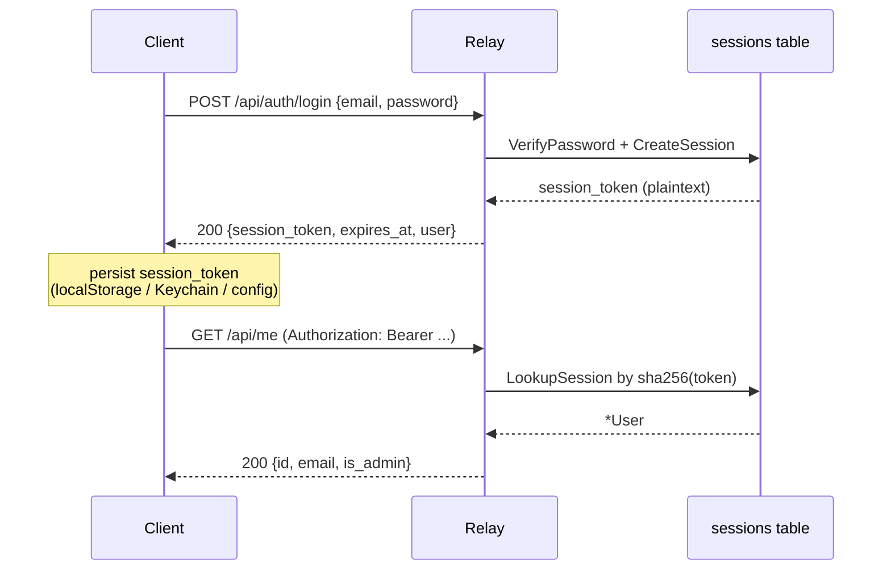

# Docs Revamp Design — AGENTS · README · docs/spec

> **Audience**: 给负责实施这次文档完善的实施者（implementer agent or human）
> **Last updated**: 2026-06-10
> **Status**: design / approved-by-user
> **See also**: [auth migration spec](./2026-06-09-relay-auth-token-removal-design.md)

## 目录

1. [背景与动机](#1-背景与动机)
2. [目标与非目标](#2-目标与非目标)
3. [文档层级与职责](#3-文档层级与职责)
4. [样式规范与元数据头](#4-样式规范与元数据头)
5. [`docs/spec/auth.md` 大纲（新建）](#5-docsspecauthmd-大纲新建)
6. [`docs/spec/protocol.md` 收窄方案](#6-docsspecprotocolmd-收窄方案)
7. [`docs/spec/architecture.md` 收窄方案](#7-docsspecarchitecturemd-收窄方案)
8. [`AGENTS.md` 改动清单](#8-agentsmd-改动清单)
9. [`README.md` 改动清单](#9-readmemd-改动清单)
10. [`docs/spec/conventions.md` / `component-style.md`](#10-docsspecconventionsmd--component-stylemd)
11. [`docs/roadmap.md` 新增章节](#11-docsroadmapmd-新增章节)
12. [交付清单](#12-交付清单)
13. [验收门槛](#13-验收门槛)

---

## 1. 背景与动机

`relay-auth-token-removal` 系列（PR #133 / #134 / #135 / #136 / #137）从根上重写了 atterm 的鉴权模型：删除 `atk_` API token、`Config.Token` 全局 share-secret、CSRF 中间件、`atterm_session` cookie 路径、`cmd/atterm-agent` CLI，统一为「邮箱+密码登录 → 拿 session_token → Bearer / `Sec-WebSocket-Protocol`」一条路。

在这次大手术里：

- AGENTS.md / README.md 在 PR #133 / #134 / #135 已经做过点状修补
- `docs/spec/protocol.md` 和 `architecture.md` 在 PR #134 做过部分重写
- 但**没有**一个统一的"鉴权权威源"文档；信息散落在 4 个文件中分别讲，话术、详略、举例都不一致
- `docs/spec/*.md` 4 份 spec 风格各异（无 "Last updated"、中英混杂、表格列宽随意）
- `cmd/atterm-agent` 等已删概念在 AGENTS:15-16/22/85 仍是 first-class 引用

## 2. 目标与非目标

### 目标

- 在 `docs/spec/auth.md` 新建鉴权**唯一权威源**——所有 Principal / session_token / pair / bootstrap / requireSession / 错误码内容都在此处定义
- 给所有 `docs/spec/*.md` 加统一元数据头（Audience / Last updated / Status / See also）
- 收窄 `protocol.md` 和 `architecture.md`，把鉴权内容搬到 auth.md，原处只留摘要 + 反向链接
- 清扫 AGENTS / README 残留的 `atterm-agent` / 过时鉴权描述
- 风格归一化：中文为主，代码/API/术语保留英文；统一标题层级、表格、代码块语言标注

### 非目标

- **不重写**架构、协议本身——只重组与归一化文档
- **不动**已 OK 的小文档（`docs/roadmap.md`、`docs/shell-integration.md`、`docs/web-push.md`），仅在 roadmap 加一个章节
- **不引入**自动化工具（markdown-toc、文档站点生成器等）——保持纯 markdown + 手动维护
- **不阻塞**正在进行的 5 个 PR——本次工作独立分支，在 5 个 PR merge 后启动

## 3. 文档层级与职责

每个文件有一个明确受众，职责不重叠。

| 文件 | 受众 | 职责 | 目标长度 |
|---|---|---|---|
| `AGENTS.md` | 在仓库里工作的 AI 编码 agent | 红线、约束、"改 X 应该碰哪些文件" 路由表 | ~180 行 |
| `README.md` | 第一次见到仓库的人 / 想跑起来的开发者 | 能力总览、快速启动、用户流程 | ~360 行 |
| `docs/spec/auth.md` | 实现或审计鉴权的工程师 | **新建**：鉴权唯一权威源 | ~500 行 |
| `docs/spec/protocol.md` | 实现 WS 帧或 HTTP 客户端的工程师 | WS 帧字典 + 非鉴权 endpoint；鉴权仅留 1 段 → 链回 auth.md | ~450 行（原 639） |
| `docs/spec/architecture.md` | 理解系统整体的工程师 | 组件图、数据流；鉴权小节改为摘要 + 链接 | ~470 行（原 482） |
| `docs/spec/conventions.md` | 改 Go / 前端代码的工程师 | 编码约定（不动内容，仅元数据头 + 风格归一） | ~399 行 |
| `docs/spec/component-style.md` | 改前端 UI 的工程师 | 组件视觉规范（不动内容，仅元数据头 + 去 dup） | ~325 行 |

**反向链接规则**：

- AGENTS 的鉴权红线 → 链接到 `docs/spec/auth.md#<具体小节>`
- README 用户流程的技术细节 → 链接到 `docs/spec/auth.md`
- protocol.md 的 `/api/auth/*` 行 → 链接到 auth.md
- architecture.md 的鉴权段 → 链接到 auth.md

## 4. 样式规范与元数据头

### 元数据头（强制）

所有 `docs/spec/*.md` 顶部加：

```markdown
# <文档标题>

> **Audience**: <一句话受众>
> **Last updated**: 2026-06-10
> **Status**: stable | draft | deprecated
> **See also**: [auth.md](./auth.md) · [protocol.md](./protocol.md)
```

- `Last updated` 是 commit-time 快照；仅 spec 大改时手动 bump，小改不强制
- `Status` 帮读者快速判断当前可信度
- `See also` 是显式反向链接

AGENTS.md / README.md 也加元数据头，但受众和职责的措辞按各自定位调整。

### 正文风格规范

| 维度 | 约定 |
|---|---|
| 主语言 | 中文 |
| 保留英文 | 变量名、SQL、HTTP header、Go/TS 类型名、endpoint 路径、shell 命令 |
| 标题层级 | H1 仅文档标题（一份一个）；H2 顶层章节；H3 子章节；H4 罕用 |
| 表格 | markdown 表格（不用 HTML），有表头分隔行；列宽不强制对齐 |
| 代码块 | 必须标语言（` ```ts `、` ```go `、` ```sql `、` ```bash `） |
| 状态码 / 数值 | 反引号包裹（`401`、`5 min`） |
| Endpoint | 反引号 + 方法前缀（`POST /api/auth/login`） |
| Commit / PR | `<7-char-hash>` 或 `#PR133`（不写完整 URL，仓库本地引用足够） |

### 反例与正例

```markdown
✗ 浏览器登陆后会拿到一个 session_token cookie     ← cookie 错误（实际是 body）
✗ Browser 拿到 token 后 stored at localStorage     ← 中英混杂、动词时态
✗ /api/auth/login 返回 { session_token }           ← 缺反引号
✗ 详见 [架构](https://github.com/.../architecture.md)  ← 用本地相对路径

✓ 浏览器调用 `POST /api/auth/login`，响应体含 `{session_token, expires_at, user}`，由客户端存入 localStorage（不再使用 cookie）。
✓ 详见 [架构文档](./architecture.md#组件矩阵)。
```

### 目录 / ToC

每份 spec 在元数据块下方紧跟 `## 目录`（手动维护，不超过 H3）。`auth.md` 必有；`conventions.md` / `component-style.md` 视长度决定。

## 5. `docs/spec/auth.md` 大纲（新建）

```markdown
# Auth — Atterm Session Token Reference

> **Audience**: 实现或审计 atterm 鉴权层的工程师
> **Last updated**: 2026-06-10
> **Status**: stable
> **See also**: [protocol.md](./protocol.md) · [architecture.md](./architecture.md)

## 目录
1. 设计目标与历史
2. 概念模型 (Principal / Session / Pairing Code / Invitation)
3. 数据模型 (sessions / users / pairing_tokens schema)
4. 鉴权流 — 状态机
   4.1 Bootstrap admin（首次启动）
   4.2 注册（邀请码 + 邮箱 + 密码）
   4.3 登录（邮箱 + 密码）
   4.4 配对（QR + 一次性 pairing token）
   4.5 撤销（logout / 管理员重置 / 过期）
5. 传输层 — token 怎么走线
   5.1 HTTP Authorization: Bearer <token>
   5.2 WS Sec-WebSocket-Protocol: atterm-token.<token>
   5.3 拒绝的姿势（?token= query / cookie 都拒绝）
6. requireSession 中间件
   6.1 提取 → 哈希 → 查表 → 注入 *User 到 context
   6.2 错误模型（401 何时返回）
   6.3 受保护路由清单
7. 公开路由白名单
8. Bootstrap admin 详解
   8.1 触发条件（env vars）
   8.2 stdout 输出格式
   8.3 自动登入桌面 App / CI 的对接姿势
9. 安全考量
   9.1 token 存储（DB sha256 哈希）
   9.2 SameSite / CSRF / cookie — 为什么都不用
   9.3 移动端 Keychain 存储
   9.4 桌面 App localAdminPassword 在 config.json 的取舍
10. 错误码字典
11. 客户端实现要点（桌面 / Web / iOS Capacitor）
```

### 各章节内容要点

**§1 设计目标**——历史动机 + spec 链接（指向 `2026-06-09-relay-auth-token-removal-design.md`）。

**§2 概念模型**——一张 mermaid 图（或 ASCII 备份）：

```
User ─[email+password]─> session_token ─[Bearer / subprotocol]─> requireSession ─> *User in ctx
                              ↑
                  ConsumePairingToken (5 min one-shot)
                              ↑
                          pairing_token
```

**§3 数据模型**——直接贴 `users` / `sessions` / `pairing_tokens` 三张表的 `CREATE TABLE`（从 `internal/userstore/migrations/0001_init.sql` 抄过来），加注释解释每列目的。

**§4 鉴权流**——5 个 mermaid `sequenceDiagram`，每个流配步骤列表 + 引用相应 endpoint。Mermaid 选择理由：GitHub 网页原生渲染好，且语义化（步骤顺序明确）。

时序图最小示例（§4.3 登录）：



**§5 传输层**——明确"为什么不用 cookie"+"为什么必须用 subprotocol（浏览器 WS 限制）"。

**§6 requireSession 中间件**——**只写行为描述**，不贴代码：

> requireSession 在请求生命周期的早期拦截，按以下顺序工作：
> 1. 从 `Authorization: Bearer <token>` 或 `Sec-WebSocket-Protocol: atterm-token.<token>` 提取 token；URL query 不读
> 2. sha256(token) → 查 `sessions.id_hash`
> 3. 校验 `expires_at > now` 且关联 user 未 disabled
> 4. 命中：注入 `*User` 到 request context，调用 inner handler
> 5. 未命中：返回 `401 unauthorized`，不区分"token 不存在"/"已过期"/"被撤销"

实现位置标注为 `internal/relay/auth.go`，但**不贴具体代码**——避免代码飘移后文档过期。

**§7 公开路由白名单**——表格：endpoint + 方法 + 为什么公开。

**§8 Bootstrap admin**——含一个完整的"操作员第一次部署 relay"剧本：env vars 设置 → 启动 → 看 stdout 拿 token → 桌面 App 或 curl 拿这个 token 做后续。

**§9 安全考量**——4 个小节，每个 50-100 字。重点说明决策 trade-off，不是 marketing。

**§10 错误码字典**——表格：`401 unauthorized` / `404 pair_not_found` / `409 pair_consumed` / `410 pair_expired` 等，每个一行 + 客户端处理建议。

**§11 客户端实现要点**——三端各 100 字，引用具体 file:line（`desktop/relay_host.go:62`、`web/src/shared/api/client.ts:48`、`desktop/frontend/src/platform/capacitor.ts:96`）。

### 删除项

原计划的 `§12 已知边界` 取消——按"行为描述 + 关键迭代点放里程碑"的指示，迭代项归入 `docs/roadmap.md` 新增章节。

## 6. `docs/spec/protocol.md` 收窄方案

当前 639 行 → 目标 ~450 行。

### 保留章节

- §概览（更新元数据头）
- §WS 帧字典（0x10 BLOB / 0x20 INPUT / 0x30 META / 0x40 RESIZE / 0x50 ANNOUNCE 等）
- §HTTP API（**仅非鉴权部分**）：`GET /api/sessions`、`GET /healthz`、`GET /version`
- §`/uplink` / `/client` / `/agent` 的 WS upgrade（前置鉴权说明仅一句"requireSession 见 auth.md"）
- §Session 状态机 / lifecycle hooks
- §错误与关闭码（CloseReasons）

### 删除并迁出

| 原内容 | 处置 |
|---|---|
| §鉴权（Browser/Desktop/Admin 三类 Principal） | 完整搬到 `auth.md` §2 |
| 行 413-427 atk_ API token 描述 | **直接删除，不迁** |
| pairing_tokens 表 + 流程 | 搬到 `auth.md` §3 + §4.4 |
| cookie session / CSRF 描述 | 删除（Phase 1 已移除） |
| `/api/auth/*` / `/api/pair/*` / `/api/me/*` endpoint 详情 | 搬到 `auth.md` §4 |
| 启动安全策略（`ATTERM_BOOTSTRAP_ADMIN_*`） | 搬到 `auth.md` §8 |

### 新增

§Auth in transit（仅 1 段，~30 行）：

```markdown
## Auth in transit

所有 protected endpoint 由 requireSession 中间件统一拦截。Token 通过：

- HTTP `Authorization: Bearer <token>`
- WS `Sec-WebSocket-Protocol: atterm-token.<token>` 或 `atterm-token-b64.<base64url(token)>`

不接受 `?token=` URL query。

完整鉴权模型（Principal、生命周期、错误码、Bootstrap 流程、客户端实现要点）见 [auth.md](./auth.md)。
```

## 7. `docs/spec/architecture.md` 收窄方案

当前 482 行 → 目标 ~470 行。改动很小，主要是简化「用户与鉴权」段：

```markdown
## 用户与鉴权

所有客户端通过邮箱+密码登录 relay。登录成功后 relay 颁发 `session_token`（明文仅返回一次，DB 存哈希），客户端在后续 HTTP/WS 请求中携带。`requireSession` 中间件统一在 mux 层拦截。

完整模型（含 bootstrap、pairing、状态机、错误码）见 [auth.md](./auth.md)。
```

其他章节（组件矩阵、数据流、PTY/relay/uplink 拓扑、bootstrap 路径）**保留不动**，仅补元数据头 + 风格归一（标点、表格对齐、引用反引号化）。

## 8. `AGENTS.md` 改动清单

当前 190 行 → 目标 ~180 行。按 5 处目标定点修改，不做整体重写：

| 当前位置 | 改动 |
|---|---|
| 顶部 | 加元数据头（Audience: AI coding agent；Last updated: 2026-06-10；Status: stable） |
| L11 红线段 | "服务端所有鉴权接口都不接受 `?token=`" 保留；删 "桌面端 API token（`atk_…`）通过 `Sec-WebSocket-Protocol` 传递"，改写为"详见 [auth.md](./docs/spec/auth.md)" |
| L15 仓库布局 `cmd/atterm-agent/` | 整行删除（PR #134 已删该目录） |
| L22 `internal/agent/` | 整行删除 |
| L84-85 命令行 agent 示例 | 整段删除 |
| L126 routing table `CLI wrapper 行为` 一行 | 整行删除 |

红线段是 AGENTS 的灵魂——保留所有原有红线（密码强度、origin 校验、CSP、rate limit、key revocation 等），只把 atk_ 相关的一行换成 auth.md 链接。

## 9. `README.md` 改动清单

当前 381 行 → 目标 ~360 行。PR #133 已经清理过大部分 atk_ 文案。剩余工作：

| 区域 | 改动 |
|---|---|
| 顶部 | 加元数据头（Audience: 新人 / 想跑起来的开发者；Last updated；Status: stable） |
| L25/27/44/80/102/121/128/135/253/254 | PR #133 已改完 atk_ → session_token；本次仅核对，不重做 |
| "用户与配对" 段（约 L80-135） | 简化为：注册 → 登录 → 选择性配对 QR；引用 auth.md 对应小节 |
| 桌面 App 设置远程 relay 段 | 简化为 1 段（如有截图保留） |
| "安全与隐私" 段（L253+） | 摘要 + "完整安全模型见 [auth.md](./docs/spec/auth.md)" |

README 不是 spec，重点是**让新人跑起来**——所有详细技术细节链到 spec。

## 10. `docs/spec/conventions.md` / `component-style.md`

仅顶部加元数据头 + 全文风格归一化扫一遍（不动内容结构）。

- `conventions.md`：编码约定、命名、错误处理——保留不动
- `component-style.md`：UI 组件视觉规范——保留不动
- 两份都按 §4 风格规范扫一遍：表格分隔行、代码块语言标注、反引号包 endpoint / 状态码

## 11. `docs/roadmap.md` 新增章节

新增 §鉴权后续，每条一行，状态 `□ planned`：

```markdown
## 鉴权后续（来自 docs/spec/auth.md 拆分时识别）

- □ session refresh / proactive renewal（30 天 TTL 滑动续期或显式 refresh）
- □ 移动端 expires_at 触发预刷新（目前 expires_at 已存但未使用）
- □ `?next=` redirect 的 CSRF / open-redirect audit
- □ 桌面 App localAdminPassword 改用 Keychain 而非明文 config.json
```

## 12. 交付清单

PR 提交在新分支 `docs/comprehensive-revamp`（off main，等 5 个 PR merge 后开），拆成 6-7 个 commit 便于 review：

1. `docs: add metadata header convention to all spec files`
2. `docs(auth): introduce single-source auth.md`（新文件）
3. `docs(protocol): slim down — auth content moved to auth.md`
4. `docs(architecture): replace user-accounts section with auth.md link`
5. `docs(AGENTS): drop atterm-agent refs; auth red lines link to auth.md`
6. `docs(README): polish; reference auth.md from quickstart`
7. `docs(roadmap): track auth follow-ups (refresh / Keychain / audit)`

合并先后顺序：1 → 2 → 3 → 4 → 5 → 6 → 7（一个 PR，commit 顺序可改）。

## 13. 验收门槛

- [ ] `grep -rn 'atk_\|atterm-agent\|web_sessions\b\|Config\.Token\|api_token' AGENTS.md README.md docs/` 输出仅来自 `docs/superpowers/`（历史 specs/plans 不在意）
- [ ] 所有 `docs/spec/*.md` 都有元数据头
- [ ] `docs/spec/auth.md` 的 5 个 mermaid 时序图在 GitHub 网页能渲染
- [ ] 不引入新的相对路径错误（每个 `[xxx](./yyy.md)` 都能跳）
- [ ] `wc -l` 总行数 ~2680 ± 50
- [ ] 不修改 5 个相关 PR 的内容（独立分支，不耦合）
