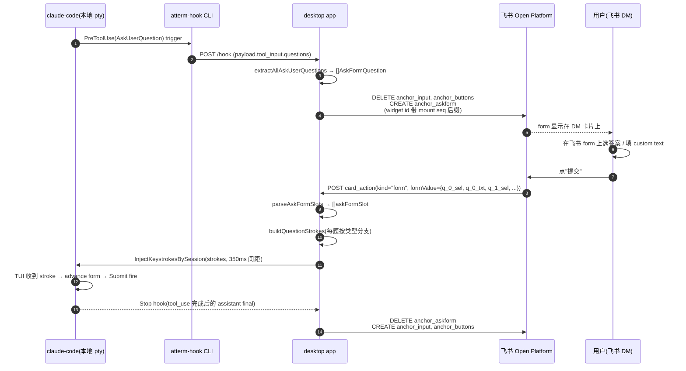

# AskUserQuestion form-based remote answering — design

Date: 2026-07-10
Status: Shipped in v0.2.171 (PR #261). See "Implementation status" for the
        per-milestone breakdown.

## 0. Implementation status (as of v0.2.171)

atterm 现在支持在飞书 anchor card 上以**表单形式**远程回答 claude-code 触发的 `AskUserQuestion` tool_use —— 每题一行下拉 + 自定义输入框,提交后按反向工程的 TUI 按键模型自动送 stroke 到本地 claude pty,form 走完到 Submit fire,claude 收到答案。

| Milestone | Status | 简述 |
|---|---|---|
| M1 hook_adapter 提取 questions + multiSelect | ✅ | `extractAllAskUserQuestions` 从 tool_input 抽 `AskUserQuestionEntry` 列表 |
| M2 form container 渲染 | ✅ | `RenderAskQuestionForm` 每题一行(select_static / multi_select_static + input),widget element_id 带 mount seq 后缀 |
| M3 form 挂拆 lifecycle | ✅ | `updateAnchorAskForm` 挂 form 时删 input + buttons;拆时按状态独立恢复 |
| M4 stroke plan 4 分支 | ✅ | 单选 / 多选 / 单选+custom / 多选+custom 各自的按键序列(反编译 claude 二进制 + 手动实测) |
| M5 stroke dispatch | ✅ | `Router.InjectKeystrokesBySession` 每键独立 SendInput,首键 inline,余键 goroutine 里 350ms 间距 |
| M6 permission grant 前置文档化 | ✅ | 用户首次遇到 AskUserQuestion permission dialog 需选 "Yes, and don't ask again",否则头两键被吃 |
| M7 upstream bug workaround: claude 丢尾字符 | ✅ | custom text 尾部加空格作牺牲字符 |
| M8 upstream bug workaround: 飞书 widget 状态缓存 | ✅ | widget element_id 加 mount seq 后缀,每次挂 form 换新 id |
| M9 spec + docs | ✅ | this file + `docs/spec/feishu.md` + AGENTS.md 红线 #30-32 |

### Known gaps after v0.2.171

1. **仅支持 claude-code**:AskUserQuestion 是 claude-code 独有的 tool_use。Codex 有 `TaskCreate` / `TaskUpdate` 类似机制但 hook 路径未做;Aider / Gemini 无对应 tool。
2. **Multi-select 用户体验限制**:飞书 `multi_select_static` 组件不支持自由输入(实测 `allow_custom_value`、`can_input`、`combobox` 等假想属性都拒绝),多选题用户如果想加自定义答案必须选 Type-something 选项。
3. **按键模型跟 claude-code 版本绑死**:模型是反编译 claude-code 2.1.168 的 minified JS + 手动键盘实测得出的,claude-code 大版本升级时(比如 3.x)可能整个 TUI 组件改写,得重新反向工程。当前用 memory 里的验证清单跑一次即可辨别是否失效。

## 1. Problem

v0.2.171 之前,`claude-code` 在 atterm session 里跑,触发 `AskUserQuestion` tool 时:

- **本地 claude TUI**弹出交互式选择界面(tab bar + option list,数字键 / Tab / Enter 导航)
- **飞书 anchor card**可以显示 body 里的问题文本(hook `PreToolUse` 拿到 tool_input 后渲染出来)
- 但用户**无法从飞书回答** —— 只能回到本地桌面手动敲键盘

这破坏了"离开工位后用手机接管"的核心场景 —— AI 问了个问题就等你回来敲键盘,远程接管形同虚设。

目标:让用户在飞书 DM 里选好答案提交,系统把答案送到本地 claude TUI,form 关闭,claude 收到答案继续。

## 2. Design

### 2.1 High-level



### 2.2 Form 结构

Anchor card 上的 form(CardKit v2 `schema: "2.0"`):

```json
{
  "tag": "form",
  "element_id": "anchor_askform",
  "elements": [
    {
      "tag": "column_set",
      "columns": [
        { "tag": "column", "elements": [{
            "tag": "select_static",
            "element_id": "askform_q0_sel_15",
            "name": "q_0_sel",
            "options": [...]
        }]},
        { "tag": "column", "elements": [{
            "tag": "input",
            "element_id": "askform_q0_txt_15",
            "name": "q_0_txt"
        }]}
      ]
    },
    // ...每题一个 column_set
    {
      "tag": "column_set",
      "columns": [
        // 提交按钮 + 重置按钮
      ]
    }
  ]
}
```

- 多选题的 select_static tag 换成 `multi_select_static`
- 每 widget 的 `element_id` 都带 `_<mountSeq>` 后缀 —— mountSeq 是当次挂 form 时 `PatchSeq` 值,每次挂新的都换新 id(见 §5.2)
- Form 提交按钮的 callback value: `{"kind": "form", "session_id": "..."}`

### 2.3 formValue → slots

用户提交后 formValue 长这样:

```json
{
  "q_0_sel": "写代码 / 实现功能",
  "q_0_txt": "",
  "q_1_sel": ["Python", "JavaScript"],   // 多选题返回 array
  "q_1_txt": "",
  "q_2_sel": "",
  "q_2_txt": "架构师"                    // 单选题用了 Type-something 分支
}
```

`parseAskFormSlots` 按 `q_<idx>_(sel|txt)` 拆成 `askFormSlot{idx, sel, selMulti, txt}` 列表,按 idx 排序。

## 3. 按键模型(反向工程)

### 3.1 反编译发现的关键 handler

反编译 claude-code 2.1.168(Bun-bundled Node.js binary,用 `strings` + grep 提取)找到多选题的 return key handler:

```js
// 多选题 tab handler,cursor 在 input widget (siH) 上时
if (C.ctrl && C.key === "return" && m && Y) { Y(D); return; }  // Ctrl+Return
if (X && Y) { Y(D); return; }                                    // 在 Submit button 上时 Enter
if (y.focusedValue !== void 0) {
    // 否则:toggle 当前 focused checkbox
    ...
}
```

其中:

- `m` = cursor on input widget (siH,ink 的 TextInput 组件)
- `X` = `isSubmitFocused`(cursor 在 form 底部的 Submit button 上)
- `Y(D)` = 提交整个 form 的 callback,`D` 是当前 selected 值集合
- `y.focusNextOption` = 光标下移一格

**关键推论**:多选题里 cursor 走到 `isSubmitFocused = true` 状态 + 按 Enter 才 fire form submit。cursor 走到 Submit 需要 `↓` 走位。

### 3.2 每题类型的 stroke 序列

按 (isMulti, hasCustom) 4 分支:

| 分支 | stroke 序列 | 说明 |
|---|---|---|
| 单选,无 custom | `<digit>` | claude 单选题的数字键 = select opt N + confirm + advance,一步搞定 |
| 多选,无 custom | `<digit>*M`,然后 `\t` (Tab) | 每个 digit toggle 一个 checkbox;Tab 从 checkbox row 触发 advance(cursor 在 non-input option 时 Tab 走的路径) |
| 单选,有 custom | `<typeIdx> <text runes> <空格> \r` (Enter) | typeIdx digit 让 cursor jump 到 Type-something 并进入输入模式;text 打字;Enter → siH.onSubmit 用 siH 自己的 local 状态(不走 controlled prop → 无 blur race);trailing space 是 §5.1 的 workaround |
| 多选,有 custom | `<digit>*M <typeIdx> <↓>*(typeIdx-1) <text runes> <空格> <↓> \r` (Enter) | 先 toggle 选中的普通 checkbox;typeIdx digit 勾 Type-something(但 cursor 不移);↓ × (typeIdx-1) 走到 Type-something 行;打字;末尾 ↓ 走到 Submit button;Enter fire `if (X && Y) { Y(D); return; }` |
| Form 末尾 | `1` | Review page 上 "Submit answers" 是 opt 1 |

**详细血泪史**见 `~/.claude/projects/-Users-attson-code-github-com-attson-atterm/memory/feedback_askform_key_model.md`。

### 3.3 关键实测数据点

- **单选题 digit = 一步 advance**:图 #74/#75/#76(用户手动实测)—— 按数字键直接跳下一 tab
- **多选题 digit = 只 toggle,不 advance**:图 #73(用户手动实测)—— 按 5 只勾 [✓] Type something,tab bar 上仍是 □,cursor 停在 opt 1
- **多选题 Tab from checkbox row = advance**:session 4bc54767 Q1 stroke plan `1 2 \t`(cursor on opt 1)成功 advance
- **多选题 Tab from Submit button = 不 advance**:session 4bc54767 Q3 stroke plan `... ↓ \t`(cursor 走到 Submit)form 卡住,图 #94
- **多选题 Enter from Submit button = advance**:session 6913ef94/01441a16 stroke plan `... ↓ \r` 成功 advance(但 ↓ 触发 blur race 丢尾字,见 §5.1)

## 4. Stroke dispatch

`internal/feishu/router.go::InjectKeystrokesBySession(sessionID, operator, strokes, delay)`:

```go
if !sub.SendInput(strokes[0]) {
    return Decision{Action: ActionReject, Toast: "输入未被接收(队列已满)"}
}
if len(strokes) == 1 {
    return Decision{Action: ActionInject}
}
go func(rest [][]byte) {
    for _, s := range rest {
        time.Sleep(interKeyDelay)
        sub.SendInput(s)
    }
}(strokes[1:])
return Decision{Action: ActionInject}
```

- 首键 inline 送出:能 surface reject(如 PTY inbound queue 满)让上层立刻知道
- 剩余 goroutine 里 sleep + send:LongConn callback 3s 时限不阻塞
- Delay = 350ms 是硬性下限。80/150/200ms 全测过,间距不够 React state 没 flush,siH controlled prop 是 stale 的,form 卡在中间。见 §5

## 5. Upstream bug workarounds

### 5.1 claude Type-something 稳定丢最后一字符

**症状**(用户实测):

- 飞书 form 填 "codex" → claude 收到 "code"
- 飞书 form 填 "优雅美感" → claude 收到 "优雅美"
- 飞书 form 填 "项目管理" → claude 收到 "项目管"
- **用户手动键盘打字也丢**(session 图 #109)

**根因确认**:不是 stroke 问题,不是 delay 问题,不是 UTF-8 处理问题 —— 是 claude AskUserQuestion TUI 组件层面的 bug,可能是 controlled TextInput 的 onBlur 提交时机比最后一 keypress 的 setState 早一拍。

**Workaround**(已内置):`buildQuestionStrokes` 里给每段 custom text 尾部追加一个空格作牺牲字符(`text := sl.txt + " "`)。claude 丢的就是空格,原文完整。

### 5.2 飞书 form widget 状态缓存

**症状**(session 图 #107):同一 anchor card 连续 2 次 AskUserQuestion,第 2 次 form 出现时下拉里加载了上一次 submission 的选择。

**根因**:飞书 CardKit v2 client 按 `element_id` 缓存 widget state,DELETE + CREATE 用同 id **不清缓存**。

**Workaround**(已内置):`RenderAskQuestionForm(sessionID, questions, mountSeq int64)` 里每个 widget 的 `element_id` 都带 `_<mountSeq>` 后缀,mountSeq 是当次挂 form 时 `PatchSeq` 分配的新值。每次挂 form 都是全新的 element,client 认成新 widget 不加载缓存。

### 5.3 AskUserQuestion permission grant 前置

**症状**:第 1 次远程回答 form 时,form 提交后 claude 没走到最后一题就 tool wedges。

**根因**:claude-code 首次触发 AskUserQuestion 时 TUI 会弹一个 permission dialog,用户没先本地按 "Yes, and don't ask again",dialog 消费掉序列头两个 stroke(`1\r`)。

**Workaround**(用户一次性操作):本地 claude-code 首次遇到 AskUserQuestion permission dialog,选 "Yes, and don't ask again"。

## 6. Rejected alternatives

以下方案都实测过,不通:

- **Tab-to-advance in multi-select from any option row** — Tab 只从 checkbox row advance,从 Submit button 或 Type-something 位置都无效
- **Ctrl+Return via LF (0x0a)** — ink 把 0x0a 当普通 return 处理(`key: "return", ctrl: false`),不触发 `if (C.ctrl && C.key === "return")` 分支;甚至在 siH 里当作 newline 插入 input(session bbd4a1ee 实测 V2ex 完整但 form 卡住,input 里多了 `\n1`)
- **Right-arrow "state pump" before ↓** — 试图强制 React 多几个 render cycle 让 setState flush,session e38a4b41 实测 ASCII "codex" + 700ms + Right-arrow pump 依然丢 "x"(证明不是 delay 问题)
- **80/150/200/350/700/1000ms delay tuning** — 全部丢尾字符,证明是 claude TUI 内部的 race 无法靠外部 delay 修
- **多选题按 digit typeIdx 两次让 Type-something 触发 advance** — 单选题这么做有效,多选题里第 2 次 typeIdx 是 toggle checkbox,把之前勾的 unchecked
- **Enter directly on siH in multi-select** — siH.onSubmit 在多选里只把 __other__ 加进 selected list,不 advance(session 6d561353 实测卡在 Q3)

## 7. Test plan(手动)

重启 wails dev 后:

- [x] `go build ./...` 通过
- [x] `go test ./desktop/feishu/... ./internal/feishu/...` 全绿
- [ ] 首次绑定飞书后,本地 claude-code 手动跑一次 AskUserQuestion,选 "Yes, and don't ask again" 授权
- [ ] 触发混合 AskUserQuestion(单选 + 多选 + 单选 custom + 多选 custom),提交后:
  - Claude 收到 4 题完整答案(无缺尾字符)
  - Anchor card form 消失,input 输入框和 `^C/^D/Esc/Enter/结束` 按钮恢复
  - 光标不留在飞书 chat 里的 pending "1"(说明 stroke 没溢出)
- [ ] 同一 anchor 上连续触发 2 次 AskUserQuestion,第 2 次 form 是空的(不加载上次 selections)
- [ ] Custom text 用 UTF-8("项目管理"、"优雅美感"、"架构师"),claude 收到完整字符串
- [ ] `-tags manual_probe` 的 `TestManualProbe_SendAndPatch` 仍能跑通(需要开发飞书 app 凭据)

## 8. See also

- 生产 spec:[../../docs/spec/feishu.md](../../docs/spec/feishu.md)
- 项目红线:[../../../AGENTS.md](../../../AGENTS.md) 红线 #30-32
- 完整按键模型 + 血泪史:memory `feedback_askform_key_model.md`
- Permission grant 前置:memory `feedback_askform_permission_grant.md`
- Hook 契约:memory `project_claude_code_askquestion_no_notification.md`
- 前一个飞书 spec(远程终端可用性修复):[../specs/2026-06-27-feishu-local-remote-terminal-design.md](./2026-06-27-feishu-local-remote-terminal-design.md)
